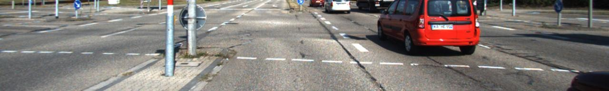

# FlowNet及试验

 [*Link:*](https://zhuanlan.zhihu.com/p/28971765)

最近自己的计划工作一直进展不太顺利，于是这周无聊看了这篇论文，另外还有两篇有关双目的，其中一篇自然是mc-cnn，但是都看得很草率，不多说。

  

## FlowNet  
这篇论文虽然标题是做光流的，不过光流和双目的算法基本差不多，都是算视差的，所以FlowNet做双目也没问题。

双目的基本想法就是：对比两张照片相同内容的位置差异。算是一个搜索+匹配的流程。所以这也是论文里FlowNetCorr应用correlation layer的原因，作者希望通过设计一个特殊的网络结构来加入这个流程。

  

论文分别提出了两个结构：FlowNetSimple和FlowNetCorr。

S的直接把两张图片叠在一起，当作一张6通道的图片训练，最后回归结果。为了保持分辨率，还是将网络中间的多尺度结果结合，利用deconv慢慢放大到原始图片的1/4大小。deconv的方法基本类似UNet那篇做分割的论文。

  

C这个，两张图片先通过不同的两个卷积网络提取特征，两个卷积网络是不同的参数，当然，不知道同样的参数会怎么样，毕竟提取特征这块似乎重用参数是没问题的。

我的猜想是：

1. 如果共享参数的话，特征提取都是统一的，但是特征提取后，结合两图的后续流程就需要从零开始计算视差。

2. 如果不共享，网络的前期就可以开始考虑学习视差相关的特征，比如（这是胡扯的）左边的图的特征会往右偏，右边的左偏，那么后续结合的网络结构会轻松一点，毕竟前期的特征已经考虑到左右图的不同了。

  

论文的重点是correlation layer(CL)。后面的refinement因为目前基本都被所有人在各种任务上用了，所以不太重点了。另外一个重点是他们整了个很大的数据集。不过和论文本身关系不大。

CL的想法就是能够将人类的先验知识注入到网络结构中：搜索+匹配。

当然，CL本身还是比较直观的：

左图的一小块patch，以此和右图每个可能位置同样大小的patch做匹配，计算相似度，相似度的计算方法就是dot product， 或者可以就直接认为是卷积，反正一样（所以， 卷积可以理解为两个向量dot product计算相似度，CNN普通层是图片里面的一块和学习到的特征做计算，这里的CL则是两张图片经过CNN后的feature map之间计算所有可能的小patch的相似度）。由于是光流，所以垂直方向和水平方向都需要计算，假设feature map大小都是(W, H)，那么可能的匹配就有W^2 \* H^2，显然，太多了。所以论文里面说了会限制匹配的最大范围外加stride。

如果换成双目的话，似乎可以大大减少垂直方向的匹配范围，反正双目都是固定好的，大部分视差都是水平方向的，而且水平的搜索范围似乎也和两相机的距离相关，所以计算量应该可以进一步减少，所以速度上应该比论文里面处理光流的快。

回到CL，我们站在双目左图的角度来看，假设每个像素的水平搜索范围都是d [-D, D](我们不搜垂直范围了)，计算的correlation value(CV)就会有(2D+1)，每个CV代表的就是该位置像素与右图距离d位置的相似度，所以论文直接把这些值作为新的通道来处理，CL输出成feature map 就是(2D+1)\*W\*H。所以，如果理想的情况下，(w, h)位置像素的视差应该就是 \_, idx = argmax(feature[:, w, h])的idx。

  

## 试验  
我自己是拿数据做了试验之后，发现没效果后再看的论文，之后再根据论文改进试验。目前来看，之前没效果的最大可能就是：迭代不够。

因为手头只有KITTI的数据，这个数据的视差图结果比较稀疏，能有一半像素有标注都够呛。我的训练是切了上半部分（因为上半大部分都是天空，基本视差都是0，最开始没切图的训练结果天空都不忍睹，而且0太多了数据分布就不平衡了），同时在训练的时候0值的位置都不参与loss计算（主要因为数据太稀疏，有些0只是因为激光雷达没打出来）。

网络结构使用的是类似于FlowNetSimple的结构，用的是自己的网络结构，因为看起来CL这层实现起来好麻烦，我又是个怕麻烦的人。目前初步的模型测试了另外一个数据集+自采的数据，给负责双目同事看觉得模型应该是学到了视差，不过自采的数据分辨率差异太大，放进去似乎没什么效果。目前来看模型还是不够准确，正在下其他更大的数据集，看看能不能组织严谨点的试验。

  

## 流水  
Mon从同事那里要了数据+给Pytorch写dataloader。Tu自己训练+调整模型，效果不好。We开看论文+调整模型。Th基本大半天都在机房帮忙弄一台坏掉的服务器，下午开始看论文后的训练。

  

## 样例  
1. 左图：

  

  
  

2. 视差图：

  

  
