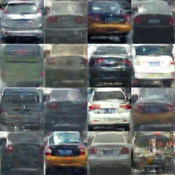

# Challenger AI 场景分类测试数据

 [*Link:*](https://zhuanlan.zhihu.com/p/29786123)

这周发现测试集出来了，于是下载了跑了一下，刚刚提交了结果。

按照网站的评价指标是95.2多一点。结果有点差......

  

Setup:

1. 框架Pytorch。

2. Res152, finetune Pytorch官方提供的网络。

3. 初始LR 0.001， 具体epoch手动调的，没注意，实际参与最后模型训练的应该在30以内。 batch\_size 192，256放不下，感觉应该是自己的程序没有注意内存分配这块。

4. 4x1080Ti

  

实际训练过程中Res34和Res50也都能达到152的验证集合上的水准，按理说152应该再提高点的，回头还是要再试试看会不会有提升。

  

这周看了下GAN相关的论文，在我们私有的数据集上试了试模型，找了张不是太恶心的。

  
