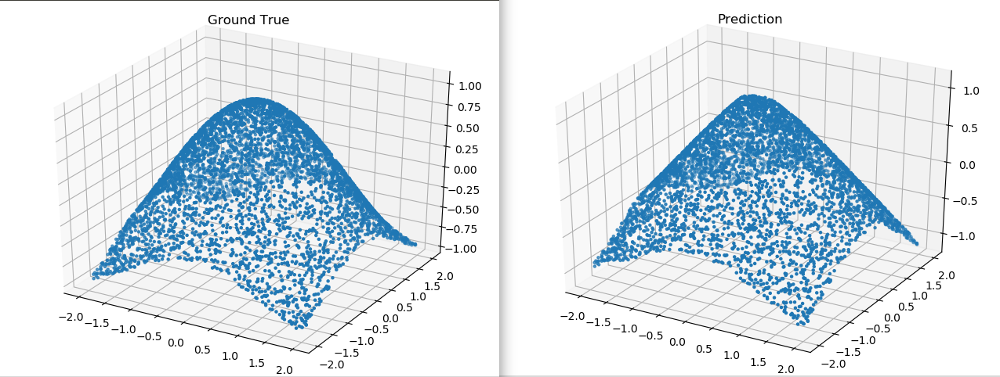

# Naive MLP

 [*Link:*](https://zhuanlan.zhihu.com/p/30736998)

这是我给新人和实习生讲东西用的代码，之前的找不到于是重写。

Young&simple, always naive.

看得出来模型拟合的结果不够平滑，应该是模型参数不够、能力有限。

  


对比结果：

  
Truth写成True了，懒得改了。

  


```
import numpy as np
import random, math


class Unit(object):
    def train(self):
        self.train=True

    def test(self):
        self.train=False

    def update(self, lr):
        pass

    def __init__(self, train=True):
        self.train = train
        
    def __call__(self, *args):
        return self.forward(*args)


class Filler(object):
    def __call__(self, weights):
        return self.fill(weights)


class NormalFiller(Filler):
    def __init__(self, loc=0.0, scale=1.0):
        super(Filler, self).__init__()
        self.loc = loc
        self.scale = scale
        
    def fill(self, weights):
        return np.random.normal(self.loc, self.scale, weights.shape)


class ConstantFiller(Filler):
    def __init__(self, value):
        super(Filler, self).__init__()
        self.value = value
    
    def fill(self, weights):
        return np.full(weights.shape, self.value)


class LeakyReLU(Unit):
    def __init__(self, slope=0.01):
        super(Unit, self).__init__()
        self.slope=slope

    def forward(self, data):
        if self.train:
            self.lt_zero = data < 0
        data[data < 0] *= self.slope
        return data

    def backward(self, gradient):
        gradient[self.lt_zero] *= self.slope
        return gradient


class Linear(Unit):
    def __init__(self, in_num, out_num, bias=True):
        super(Unit, self).__init__()
        self.weights = np.ndarray((in_num, out_num))
        if bias:
            self.bias = np.ndarray((1, out_num))
        else:
            self.bias = None

    def fill_weights(self, filler):
        self.weights = filler(self.weights)

    def fill_bias(self, filler):
        self.bias = filler(self.bias)

    def forward(self, data):
        r = data.dot(self.weights)
        if self.train:
            self.data = data
        if self.bias is not None:
            r += self.bias
        return r

    def update(self, lr):
        self.weights -= self.grad * lr
        if self.bias is not None:
            self.bias -= self.bias_grad * lr

    def backward(self, gradient):
        if self.bias is not None:
            self.bias_grad = np.sum(gradient, 0)
        self.grad = self.data.T.dot(gradient)
        return gradient.dot(self.weights.T)


class MSE(Unit):
    def forward(self, predict, target):
        return (((predict - target)**2).sum(1).mean())

    # No average
    def backward(self, predict, target):
        return 2*(predict - target)


class NaiveDataset(object):
    def __init__(self, size):
        self.size = size

    def __call__(self):
        for i in range(self.size):
            x0 = random.random()*4 - 2
            x1 = random.random()*4 - 2
            y = (x0**2 + x1**2)**0.5
            y = math.cos(y)
            yield np.asarray([x0, x1]).reshape(1, 2), np.asarray([y]).reshape(1,1)


def train():
    lr = 0.01
    l0 = Linear(2, 20)
    l1 = Linear(20, 10)
    l2 = Linear(10, 1)
    relu = LeakyReLU()
    relu1 = LeakyReLU()

    e = MSE()

    l0.fill_weights(NormalFiller(0, 0.1))
    l0.fill_bias(ConstantFiller(1.5))
    l1.fill_weights(NormalFiller(0, 0.1))
    l1.fill_bias(ConstantFiller(1.5))
    l2.fill_weights(NormalFiller(0, 0.1))
    l2.fill_bias(ConstantFiller(1.5))
    
    db = NaiveDataset(100000)

    hit = 0
    for c, (x, y) in enumerate(db()):
        y_ = l2(relu1(l1(relu(l0(x)))))
        loss = e.forward(y_, y)

        # Loss & stop.
        if c % 1000 == 0:
            print loss
        if loss < 0.0001:
            hit += 1
            if hit > 5:
                print "ALL DONE", c
                break
        else:
            hit = 0

        # Backward.
        l0.backward(
            relu.backward(
                l1.backward(
                    relu1.backward(
                        l2.backward(
                            e.backward(y_, y))))))
        # Naive update.
        l2.update(lr)
        l1.update(lr)
        l0.update(lr)
    


    # Plot
    import matplotlib.pyplot as plt
    from mpl_toolkits.mplot3d import Axes3D
    fig1 = plt.figure()
    fig2 = plt.figure()
    ax1 = Axes3D(fig1)
    ax2 = Axes3D(fig2)
    ax1.set_title('Ground Truth')
    ax2.set_title('Prediction')

    db = NaiveDataset(5000)
    X0 = []
    X1 = []
    Y = []
    Y_ = []
    for c, (x, y) in enumerate(db()):
        X0.append(x[0, 0])
        X1.append(x[0, 1])
        Y.append(y[0, 0])
        Y_.append(l2(relu1(l1(relu(l0(x)))))[0, 0])
    ax1.scatter(X0, X1, Y, marker='.')
    ax2.scatter(X0, X1, Y_, marker='.')
    plt.show()

        
if __name__ == '__main__':
    train()
```
