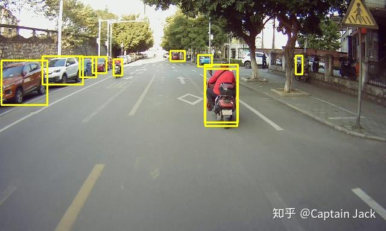
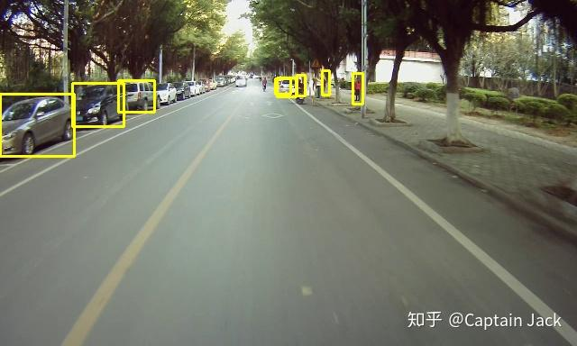
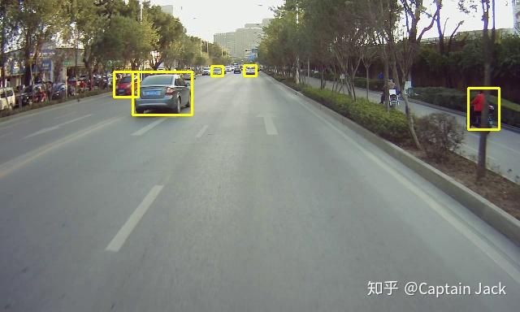
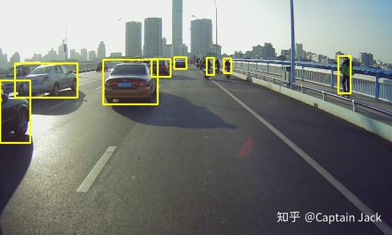

# 数据质量的重要性与多尺度的重新思考

 [*Link:*](https://zhuanlan.zhihu.com/p/36414486)

## 数据质量的重要性  
  

从目前的经验来看，对于日常的模型训练来说，一个十分重要的因素就是数据。数据的因素，包括数据质量与数据丰富性。

  

正常的应用场景下，我们往往并不追求模型是否是 state of art，只是不断的迭代改进。在这样的前提下，一个模型的好坏最主要的影响因素基本就是数据质量。原因很简单，由于 DL 的模型容量很大，使用一个差不多的网络，一般的训练参数，就可以得到表现的不错（或者是足够好）的模型，花费在调参上的时间没有一般想象的多。那么决定模型本身表现的最大的因素并不是网络参数和各种超参，而是训练数据。你交给网络什么样的数据，网络就会学习到什么样的结果。所以，如果一个模型训练出来，指标并不理想，那么首先检查的应该是数据质量，而不是检查模型本身。大概率的情况下，是训练数据的问题。可能是本身的标注质量不足，精度不够；也可能是数据生成过程中出现了各种遗漏；也有可能输入数据的本身质量不佳，比如某些图片可能会有曝光不准、图片质量降低等等。

  

对于保证数据丰富性，主要的目的就是为了模型的泛化能力。过于单一的数据会非常容易让模型过于拟合训练数据，在前面数据质量可以保证的前提下，数据量往往就是模型指标提升的重要手段。多增加其他的数据集合参与训练，尤其是 from scratch 的训练，还是可以有效提升模型指标的。另外一个经常使用的手段就是数据增强，数据增强可以很有效的防止过拟合，而且也不费力的大量增加了数据，但是数据增强需要考虑的是整个数据集依然还是在原来训练数据的场景范围内，如果原来的数据场景单一，数据增强的效用就受到很多限制，这时候需要考虑的是增加训练数据的场景丰富性。模拟数据是否有效果我并没有试验过，但我的猜测是单纯的依靠模拟数据可能对模型的性能会有损害，模拟数据的分布十分单一，场景复杂度与真实场景是有数量级的差距的，模拟数据包括光线、目标种类、周边环境往往都是根据固定公式、模型生成的，多样性是十分受限的，少量的模拟数据加入或许是可以增加模型的泛化，但是大量依赖模拟数据会造成模型向模拟数据生成函数的方向拟合。对于利用生成对抗模型的想法，本身的生成模型也是一个模拟的分布，所以我猜测也是少量或许会有提升，但是大量依赖这样的方法可能会误导模型的训练。所以数据的丰富性，在成本能够承受的情况下，实际数据的采集和标注才是最根本的，其他方法只能说是锦上添花。

  

另外一个类似于增加数据丰富性的方法就是使用预训练的模型在新的数据集上进行调优，很多论文中也都是优先使用 ImageNet 一类的大数据集进行分类训练，之后会在新的任务上再调整模型结构进行训练。我的经验是，第一，分类任务的训练会更加高效，可以快速的利用分类任务让网络学习到各种特征，使用其他的任务训练往往没有这么高效，毕竟分类任务是很成熟的训练流程，学习速度更加可靠，所以多任务网络中也可以尝试增加一个分类任务来辅助训练；第二，分类任务都有十分大量的数据集，可以利用这些丰富的数据集，相当于变相的增加了数据丰富性。对于预训练，我们可以认为是用之前训练的先验知识初始化网络，而非随机分布。这样相当于对网络增加了先验知识的限制，同时我们往往也会使用一个比较小的 lr 进行训练，一般认为较小的 lr 更加容易陷入局部最优或者鞍点，这样的组合，对于神经网络这样的人类实在无法直接干涉注入先验知识的模型，提供了在先验知识附近寻找一个局部最优点的途径。

  

  

## 多尺度的重新思考  
  

之前一直在尝试利用多尺度的特征的融合来获得更好的小目标检测结果。因为由于网络对图片（或者是特征）的不断缩小，比如 Pooling 和 stride!=1 的 conv，会丢失目标的精确位置信息，所以希望通过融合多个尺度的特征来尽量保留目标更加精确的位置信息。新的试验经验告诉我，更加低分辨率的特征未必不可以保留小目标的位置信息。小目标的位置信息理论上可以通过多层网络传递到更深层次的网络中，只是可能其中的 Pooling 层会造成信息传递的损失，在控制 Pooling 层数的情况下，将高分辨率的信息压缩到低分特征上的可能性是存在的。同时，由于减少了多个尺度的融合、最终输出的特征尺寸更小，也为提高网络的检测速度提供了可能性。

  

下面的几张结果就是利用 Mobilenet V2 作为特征提取的检测网络的结果，使用了别人在 ImageNet 上预训练的参数，输入图片尺寸为 384x640，输出尺寸为 12x20（我又后续下降到了 6x10 的尺寸后再 Upsample 融合两个分辨率的结果）。虽然模型的整体指标并不理想，但是结果已经显示，小目标的位置信息可以在网络中传递到更深的层中，同时也带来了更好的运行速度。当然，我想这也并非是没有代价的，为了传递信息，网络需要学习压缩和解码这些信息，然后尽量的传递到下一层中，这些工作理论上都是需要占用一部分模型的容量来处理的。虽然，处理压缩位置信息的容量可以是相对固定的，但是随着检测任务的复杂度增加，同时对检测性能指标的要求提高，不知道低分的结构是否还能够应付（我的预估是处理信息压缩和传递以及最后解码恢复的模型容量是相对固定的）。

  
  
  
  
在利用多尺度特征的图像分割任务的训练中，我也发现了低分尺度的网络路径上更加难以学习、甚至没有学习效果，同事的训练中也遇到了这样的问题，所以每个尺度单独利用一个对应分辨率的标注进行辅助训练是有必要的。这一方法我在之前也尝试过，但是发现与直接训练的指标相比没有显著不同，反而准备数据更加复杂，但是当时并没有去查看网络内部的学习情况，所以没有发现网络难以学习的情况。

