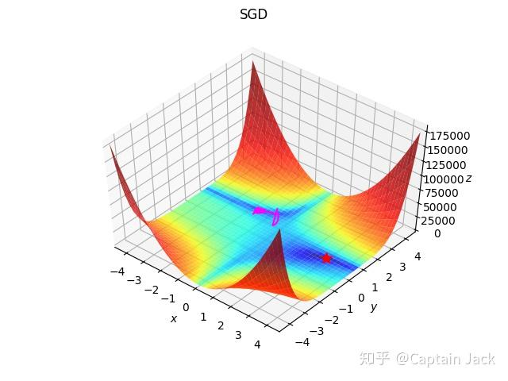

# Naive gradient descent

 [*Link:*](https://zhuanlan.zhihu.com/p/37663191)

上周四加今天上午写的玩具。

  


Refs:

[An overview of gradient descent optimization algorithms](http://ruder.io/optimizing-gradient-descent/index.html)基本按照上面的顺序写的，adadelta没看清楚blog上的，点开的论文看了看。后面三个懒得写了，那天有心情的时候继续吧。但愿实现的都是对的，也但愿我的导数没推错，反正看起来能工作。

  


附赠一个失败的SGD的路线图：

  

```
import math
import numpy as np

from mpl_toolkits.mplot3d import Axes3D
import matplotlib.pyplot as plt
import functools
from functools import partial

from matplotlib.colors import LogNorm


dx = lambda x, y: 2 * (1.5 - x + x*y) * (-1 + y) + 2 * (2.25 - x + x*y**2) * (-1 + y**2) + 2 * (2.625 - x + x*y**3)*(-1 + y**3)
dy = lambda x, y: 2 * (1.5 - x + x*y) * x + 2 * (2.25 - x + x*y**2) * 2*x*y + 2 * (2.625 - x + x*y**3) * 3*x*y**2
f = lambda x, y: (1.5 - x + x*y)**2 + (2.25 - x + x*y**2)**2 + (2.625 - x + x*y**3)**2


def show(x_range, y_range, paths, f, minima, color=(1, 0, 1), title=None):
    xmin, xmax, xstep = x_range
    ymin, ymax, ystep = y_range
    x_path, y_path, z_path = paths
    mx, my = minima
    plt.figure()

    if title:
        plt.suptitle(title)
        # plt.title(title)
    x, y = np.meshgrid(np.arange(xmin, xmax + xstep, xstep), np.arange(ymin, ymax + ystep, ystep))
    z = f(x, y)
    ax = plt.axes(projection='3d', elev=50, azim=-50)
    ax.set_xlabel('$x$')
    ax.set_ylabel('$y$')
    ax.set_zlabel('$z$')
    ax.set_xlim((xmin, xmax))
    ax.set_ylim((ymin, ymax))

    mz = f(mx, my)
    ax.plot(([mx]), ([my]), ([mz]), 'r*', markersize=10)
    ax.plot_surface(x, y, z, norm=LogNorm(), rstride=1, cstride=1,
                    edgecolor='none', alpha=.8, cmap=plt.cm.jet)
    ax.plot(x_path, y_path, z_path, color=color)
    plt.show()


def sgd(**kwargs):
    lr = kwargs['lr']

    def step(x, y):
        nonlocal lr
        x_ = dx(x, y)
        y_ = dy(x, y)
        x -= lr * x_
        y -= lr * y_
        return x, y
    return step


def sgd_momentum(**kwargs):
    vtx = 0
    vty = 0
    lr = kwargs['lr']
    m = kwargs['m']

    def step(x, y):
        nonlocal vtx, vty, lr, m
        xv = m * vtx + lr *dx(x, y)
        yv = m * vty + lr *dy(x, y)
        x -= xv
        y -= yv
        vtx = xv
        vty = yv
        return x, y
    return step


def adagrad(** kwargs):
    gx = []
    gy = []
    eps = 1e-8
    lr = kwargs['lr']

    def step(x, y):
        nonlocal gx, gy, eps, lr
        gx.append(dx(x, y))
        gy.append(dy(x, y))
        rx = math.sqrt(functools.reduce(lambda sum, x: sum + x ** 2, gx, eps))
        ry = math.sqrt(functools.reduce(lambda sum, y: sum + y ** 2, gy, eps))
        x -= lr/rx*gx[-1]
        y -= lr/ry*gy[-1]
        return x, y
    return step


def adadelta(**kwargs):
    e_gx = 0
    e_gy = 0
    e_dx = 0
    e_dy = 0
    gamma = kwargs['gamma']
    eps = 1e-8

    def step(x, y):
        nonlocal e_dx, e_dy, e_gx, e_gy
        gx = dx(x, y)
        gy = dy(x, y)
        e_gx = gamma * e_gx + (1-gamma) * gx ** 2
        e_gy = gamma * e_gy + (1-gamma) * gy ** 2
        rms_gx = math.sqrt(e_gx + eps)
        rms_gy = math.sqrt(e_gy + eps)
        rms_dx = math.sqrt(e_dx + eps)
        rms_dy = math.sqrt(e_dy + eps)
        delta_x = rms_dx / rms_gx * gx
        delta_y = rms_dy / rms_gy * gy
        e_dx = gamma * e_dx + (1 - gamma) * delta_x ** 2
        e_dy = gamma * e_dy + (1 - gamma) * delta_y ** 2
        x -= delta_x
        y -= delta_y
        return x, y
    return step


def adam(**kwargs):
    beta_1 = kwargs['beta_1']
    beta_2 = kwargs['beta_2']
    lr = kwargs['lr']
    mx = 0
    my = 0
    vx = 0
    vy = 0
    eps = 1e-8
    t = 0

    def step(x, y):
        nonlocal beta_1, beta_2, mx, my, vx, vy, t
        t += 1
        gx = dx(x, y)
        gy = dy(x, y)
        mx = beta_1 * mx + (1 - beta_1) * gx
        my = beta_1 * my + (1 - beta_1) * gy
        vx = beta_2 * vx + (1 - beta_2) * gx**2
        vy = beta_2 * vy + (1 - beta_2) * gy**2
        mx_h = mx/(1-beta_1**t)
        my_h = my/(1-beta_1**t)
        vx_h = vx/(1-beta_2**t)
        vy_h = vy/(1-beta_2**t)
        x -= lr * mx_h / (math.sqrt(vx_h) + eps)
        y -= lr * my_h / (math.sqrt(vy_h) + eps)
        return x, y
    return step


def optimize(optimizer, dx, dy, ix, iy, iters=1000):
    x_path = [ix]
    y_path = [iy]
    for i in range(iters):
        ix, iy = optimizer(ix, iy)
        x_path.append(ix)
        y_path.append(iy)
    return ix, iy, x_path, y_path


ix, iy = -1, 2 # momentum可以冲出局部最优。
# ix, iy = -1, 1 # 似乎都无法逃脱， momentum加速不足，无法冲出低谷。
# ix, iy = 3, 4 # 由于梯度过大，sgd的lr必须很小。

sgd_f = sgd(lr=0.01)
sgd_momentum_f = sgd_momentum(lr=0.01, m=.9)
adagrad_f = adagrad(lr=0.01)
adadelta_f = adadelta(gamma=0.9)
adam_f = adam(beta_1=0.9, beta_2=0.999, lr=0.001)

mx, my, x_path, y_path = optimize(sgd_f, dx, dy, ix, iy, iters=2000)
x_path = np.array(x_path)
y_path = np.array(y_path)
z_path = f(x_path, y_path)
print(mx, my)
show((-4.5, 4.5, .2),
     (-4.5, 4.5, .2),
     (x_path, y_path, z_path),
     f,
     (3, 0.5), title="SGD")
```
