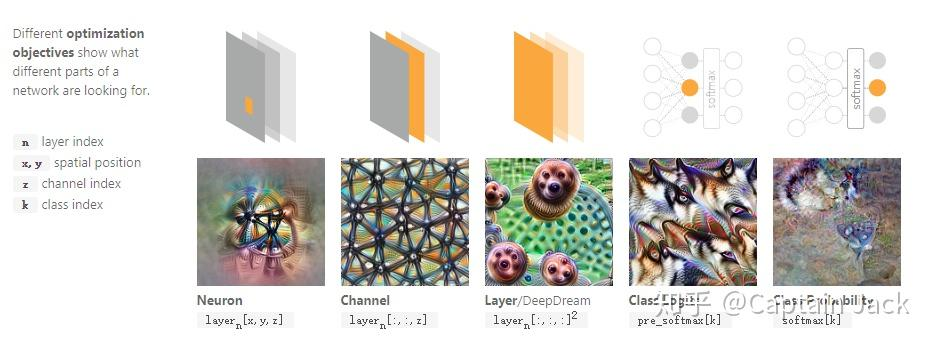
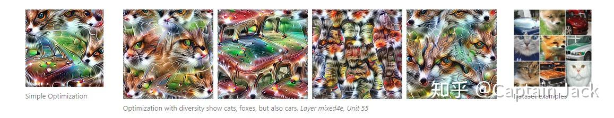

# Feature Visualization Notes

 [*Link:*](https://zhuanlan.zhihu.com/p/41429775)

Distill.pub上断续有好几篇有关网络可视化相关的文章。

对于网络的可视化，是有助于理解网络的部分功能。何况本身理解可视化的作用的过程也可以对网络更好的理解，同时这也是GAN技术的来源。

当然，我还是觉得可视化对本身的网络训练没有直接的作用，只是提供新的理解和启发。

这次看得这篇：

[https://distill.pub/2017/feature-visualization/](https://distill.pub/2017/feature-visualization/)图片都是distill.pub上的，不特别注明，版权都是原作者的。

  

## 优化方法的意义  
对于神经网络神经元级别的理解，最朴素的做法就是直接跑一遍数据集合，记录特定神经元的激活情况，把激活程度记录下来。观察激活程度强的图片就可以对特定神经元的检测特征有一定的理解。

但是，这个还是稍微黑盒了点，具体的特征到底是什么还是不好确定的，我们看到是大量的图片，虽然这些图片可能会有一些共同的特征，但是这些特征依然只是我们观察图片后的推测，并没有可以支持这个推测的实际证据。所以需要通过对图片的梯度的传递来回溯神经网络特定部分（包括特定神经元这样的情况）检测的特征，也就是利用梯度进行优化的方法。

  
distill上的图片就解释了朴素做法的局限，数据集合的图片的共性和网络的实际特征有相关性，但是具体是什么，通过优化方法能够获得更加直接的回答。文章也提到了利用优化方法的另外一个好处，外科手术式的操作，不再受数据集合限制，我们可以很好的研究网络某个部分、某几个部分的功能，随意的限制和启用它们。  

## 针对网络不同部分的优化  
在训练阶段，我们固定的是图片数据，然后梯度更新的是网络权重，这样通过学习过程可以提取图片的特征。那么也可以反过来，固定网络权重，将输入（也就是图片）作为更新对象，那么这张图片自然就可以表现出网络的特征。

  
这张图片就说明了网络不同部分的优化结果，

* 单个的神经元，优化的位置就是起receptive field的范围，当然越靠外单个神经元的影响就越小。
* 如果针对channel，那么就是某个神经元针对全图的特征，所以可以看到左1的特征在左2图片上扩展到了全图。
* 如果针对整个layer，那么就可以知道这层所有神经元在随机图片上的特征表现，由于图片的随机性，某些部分会让某一个或者某些神经元更加容易优化，最后的结果就是整个layer中针对当前随机输入比较敏感的一些神经元的特征表现（或者说针对随机图片的特点更加容易优化的神经元特征）。
* 进一步，延伸到最后的类别情况，就是全图针对某个类别的响应，随机的输入数据会在不断迭代后将网络特定部分关注的特征表现出来。4图看起来似乎是个企鹅的类别...
* 图5则是在Softmax后的概率优化，效果不好。我自己的猜测可能原因是：
1. Softmax在计算概率的时候引入了其他类别的pre\_softmax[...]的值。
2. Softmax压缩了原来pre\_softmax[k]的值，梯度的传递难度更大。（那么是不是Sigmoid或者Tanh也会造成这样的现象呢？这两也是类似Softmax的。）

  

## 单一神经元特征的多种可能  
在我们针对单一神经元的优化过程中，虽然针对的是单一神经元，但是随着神经元在网络中的位置更加抽象（更加接近最终输出位置），神经元的识别能力是不断增长的，底层的神经元可能只可以检测单一特征，但是更加抽象的神经元是多个特征的组合。

所以，可能一个位置在一定抽象层次的神经元可以检测的是多种特征的组合，但是上面说到的优化只是一个结果，可能只是神经元针对当前的随机输入的特征。

所以对我来说，最朴素的方法就是：

1. 增加随机性，考虑其他不同的随机方法。
2. 多跑几个结果。（从概率的角度来看可能并没有太大效果，在随机噪音的基础上，优化都会出现相同的趋势，造成结果没有太大不同。这个推测可以从针对channel的优化上看到，全图不同的位置是相同随机分布的不同采样，然而结果都是类似的）

文中提供的是增加一个优化项，这样在优化的过程中会更加的倾向多样化。

  
在这张图片中就是文章举例的一个非常多样性的结果，猫脸和车头都在一个神经元上进行了检测。

所以单个的神经元代表的特征可能具有很大的多样性，并不一定有一个清晰的分界。文中又已Word2Vec作为类比，图片在神经网络中的编码可能是与Word2Vec类似的distributed representation。在自己考虑增加稀疏性是否一定是CNN增加性能的方向的时候也考虑过Word2Vec的情况，distributed representation相比稀疏编码，可以表达更大的更加平滑的空间。这样的形式，网络可以压缩更多的信息进入feature map中，表现出更多复杂的组合。当时，我看到的知乎上的一个回答，强调的是CNN的改进趋势是不断的增加稀疏性。但是起码在训练的过程中，CNN并不是一定奔着稀疏性去的。(在[12]Network Dissection: Quantifying Interpretability of Deep Visual Representations这篇文章里面提到的是Interpretability依然是有效果的，并且与网络的识别能力正相关，虽然并非完全一致。)

  

## 特征可视化面对的困难  
单纯的针对神经元的优化不能带来理想的效果，更大可能性是一些不明显的噪音和马赛克效果。文中的猜测是

1. 在针对图像的优化过程中，梯度的传递只是单纯的为了快速激活神经元，所以并不是向着一定要有人类可以识别的模式的方向优化，虽然后面随着迭代次数增多会有人类可识别的模式出现。
2. 马赛克效果来源于strided的卷积和pooling。这个似乎已经是共识，很多论文都在讨论卷积和pooling带来的马赛克效果。

这里我自己认为可以考虑为优化过程对网络参数的过拟合，达不到人类希望的效果。当然，到底是针对什么的过拟合并不确定，从现在的推测来看，网络结构带来了马赛克效果的过拟合，同时网络权重带来了类似adversarial example的效果。

  

## 克服过拟合（图像无意义、马赛克）的方法  
文章里面提到的是目前论文针对这些问题有三类方法，从克服过拟合的角度来看，那么正好分别就是三个训练网络是大量使用的方法：

1. 使用正则化，在优化过程中增加直接针对高频的限制，比如限制相邻像素的变化、每步都进一步的模糊图像。这样是无差别的针对的高频特征，带来的结果是有些高频特征是有意义的，但也在优化过程中被限制了。
2. 类似数据增强，针对随机图像做一些随机变化。如果是严格等价的数据增强，那么应该是针对网络参数的，不知道如果可以针对网络参数进行一些数据增强的方法是否也会有效果？
3. Finetune，相比直接的随机图片采用更加真实的图片作为优化初始值。这样就类似训练时使用预训练模型的finetune。带来的问题是效果好看，但是失去了研究和分析的意义，因为不好区别是输入图片带来的特征还是网络模型的特征。（不过，如果人工多分析几张不同图片进行对比，或许也是可以克服的）

## 预条件与参数化解决高频模式（Preconditioning and Parameterization）  
在针对梯度的高频压制的方法中，虽然对优化的结果有影响，但是最终梯度还是会因为不断的高频特征的影响向原来的方向（作者认为不能确认是否是属于regularizer）。对梯度进行变形的操作就是Preconditioning，由于操作的是梯度，所以本身的loss曲面没有改变，该怎样还是怎样，局部最小点都没有任何变化，只是由于梯度在某些方向上有改变，所以可能会跳到不同的最小点上，获得更快的优化（所以，我的理解是起到了类似momentum的作用，改变了梯度下降的方向，当然，整体依然会和loss的曲面保持一致）。

事实上文中的[15]Visualizing GoogLeNet Classes这篇文章已经说明了，针对梯度的高斯模糊效果不如直接针对图片的。不过可以再看下[15]这篇的做法，[15]作者在AlexNet上直接使用针对图片的高斯模糊就可以获得一个不错的效果，但是如果换做是GoogLeNet，效果就会下降，[15]作者认为可能是因为这个网络的层次太深了，所以最后利用GoogLeNet训练时在不同位置接出的分类器进行优化，这样首先利用最后分类器优化整体结构，因为这个更加抽象，而且看到的范围更大，之后不断向浅层的分类器过度，填充细节。这个过程很像画画的过程，首先打个模糊的框架和比例，然后不断的增加细节。

对于如何选择这样的一个Preconditioner，作者认为是让数据尽量的不相关。在这里我的理解就是傅里叶转换后的频率上让高频和低频都可以获得相同的更新量。文中说Preconditioning对马赛克问题有改善，然而在后续的例子上，我对比了Decorrelated Space和Transformation Robustness两种方法，明显的后者对马赛克现象改善的更加明显......前者貌似没太大改善，摊手啊，也可能我的眼神不好。而且从直觉上看，后者也更加简单粗暴直指中心。这个马赛克现象和相机的摩尔纹类似，都是采样越来越低无法还原原始数据的问题，相机的方法是加低通滤镜（这个类似Preconditioning，但是针对的是数据不是梯度......所以更接近[15]作者对图片的高斯模糊），同时增加CMOS的分辨率（这个相当于改变网络结构，减少pooling和strided conv），但是还有一个方法，变换下相机位置，这个不就是Transformation Robustness做的工作么？简单粗暴啊。

  

## Next  
文章后面的Conclusion我就不废话了，我自己倒是很好奇这个lucid的具体实现的内容，所以决定过一遍代码。

另外还有其中的一些Refs我可能要再看一下，先这样吧，对于码畜能读到这步已经不容易了。

