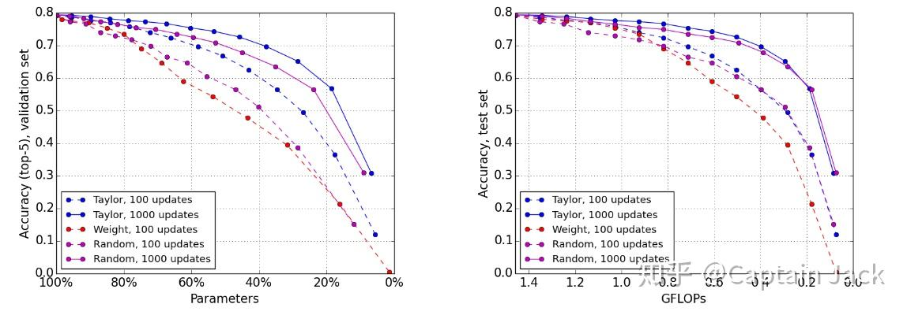
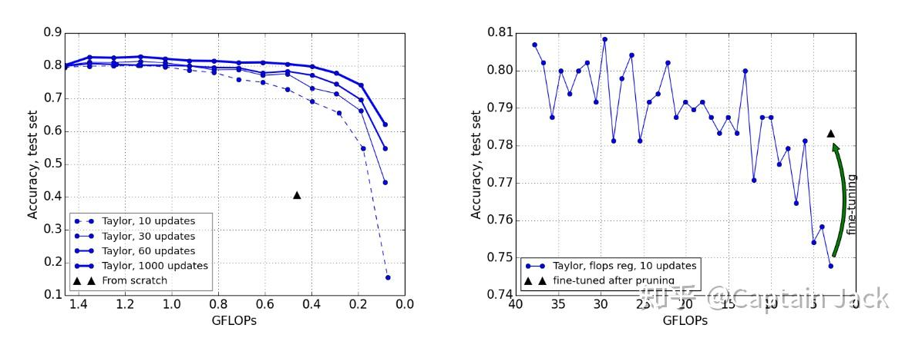

# 有关网络裁剪的相关论文三篇

 [*Link:*](https://zhuanlan.zhihu.com/p/46923640)

首先，来自以下专栏的两篇论文

[https://zhuanlan.zhihu.com/p/46839396](https://zhuanlan.zhihu.com/p/46839396)

* [https://arxiv.org/abs/1810.05270](https://arxiv.org/abs/1810.05270)
* [https://arxiv.org/abs/1810.04622](https://arxiv.org/abs/1810.04622)

这段时间正好也在弄prune相关的事情，所以很好奇，昨天知道这两篇论文后就赶紧看了下。

  

事实上，第二篇的内容基本很类似第一篇，而且Refs里面的第一个就是第一篇论文，所以应该就是第一篇的一次快速的跟进。

主要还是第一篇的一些结论比较有意思。论文是偏重试验的，所以主要就是看对比图表，然而比较多，懒得贴。

  

基本结论就是：

1. 试验中的几种方法，使用裁剪后的结构重新训练的网络基本都接近，甚至超过了裁剪后再调优的网络。如果考虑到计算量，裁剪网络可以增加训练的epoch的话，基本都是妥妥的超过裁剪+调优的网络结构，甚至可以超过原始网络。
2. 裁剪获得增益，更多的是网络结构上的好处（更多变、高效的结构，减少了参数量和运算量）。同时，固定比例裁剪（predefined）和自动化变化比率的裁剪(automatic)相比，automatic的效率更高，可以用更少的参数获得等量甚至更好的结果。
3. 所以，裁剪可以认为是高效网络结构的搜索算法。

  

当然，这都是运算资源有保证的情况下，毕竟从头开始训练是需要时间的。别人的预训练好的模型直接拿来裁剪一下就可以用，而且指标上的差异也没有显著到有影响的情况，还是裁剪省时间和运算资源一点。

---

以上是批判一番的两篇，下面是之前看的一篇：

* [https://arxiv.org/pdf/1611.06440.pdf](https://arxiv.org/pdf/1611.06440.pdf)

  

当时读论文的时候就发现了一个比较有意思的现象，现在回头来看，似乎倒也是与这两篇有点呼应：

  
这是文中的一个截图，文中还有其他的图表，但是这个是比较明显的一个，而且和调优的量直接相关。

  

**随机算法与选择算法的较小差异**

对于随机的裁剪方法，只要后续跟进了足够的调优次数，也是可以接近使用算法挑选后的结果的。尤其是按照FLOPs评价的话，这个差距更小。似乎Min Weight的方法也没有画出来1000updates的曲线。  

实际上，裁剪本身就是为了速度，可能更加关注的就是计算量这个标准。同样的计算量，随机竟然和算法挑选的十分接近。当然，更有意思的是，Min Weight的方法基本一直被随机算法压制......

  

对于随机算法在FLOPs指标上的表现，我的理解是：

考虑到CNN大部分的运算量是在前端高分辨率的部分，文中同时提了conv filter的重要性是随着深度增加降低的。所以，选择算法可能更加倾向于裁剪掉网络深层的权重，那么就对FLOPs的影响比较小，随机算法的话，应该没这个bias...所以FLOPs上更加明显。

  

**调优的重要性**

另外一个现象是，文中强调的：裁剪后的调优可以获得十分显著的提升，上面的图就已经可以说明了。下面的图则更加明显：  

  
  

**两者结合**

结合随机裁剪的对比结果和调优的显著效果两点，确实会让人怀疑：网络权值的影响可能没有想象中大。这也是我之前读这篇产生的疑问，那么这个怀疑就与最新的这两篇论文有了呼应。

  

不过产生了一个可能的冲突就是：

1. 新论文认为裁剪本身是一个网络结构搜索的过程，最终获得的网络结构才是影响网络准确率的主要因素。
2. 老论文的随机裁剪的表现同样表现的很不错，即使表现略差，拉不开距离的话，上面说的结构搜索的有效性也存疑。

  

所以如果有一个随机裁剪后的网络，从头训练的对比，可能会更好的说明这个结构搜索的有效性怎么样。  

如果，不支持有效的话。那么我的猜测就是：

1. 网络权值初始化的多样性可能是背后的主要因素，裁剪+调优可以认为是在预训练的权值基础上的训练；裁剪后重新训练，考虑到使用的He Kaiming的初始化方法，裁剪后的网络更加参差，初始化的多样性是增加的。
2. 单纯的网络训练不足，于是增加epoch总会有更多的收获。

