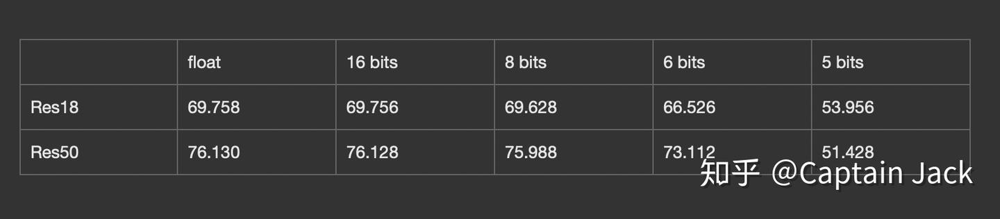

# 模型(伪)量化

 [*Link:*](https://zhuanlan.zhihu.com/p/50518800)

之前做了一个合并BatchNorm和Conv的试验：

[Captain Jack：PyTorch 卷积与BatchNorm的融合](https://zhuanlan.zhihu.com/p/49329030)所以，量化自然就是下一步工作。

## 主要的参考  
* [https://arxiv.org/abs/1806.08342](https://arxiv.org/abs/1806.08342)
* [https://arxiv.org/abs/1712.05877](https://arxiv.org/abs/1712.05877)
* [https://arxiv.org/abs/1511.06393](https://arxiv.org/abs/1511.06393)

  


## 简单低劣的量化  
这里应该算是linear的量化，zero\_point找的比较粗暴，肯定有更加优雅的。

***局限：***

* 伪量化，我只是首先量化为0-255（8bits的话），然后再重建到float（这里精度因为量化操作，丢失了一部分），再进行测试。
* 没有量化activation这块，也算不上完整的量化。下一步就弄，这个需要跑sample、统计数据后弄，逻辑相对比较复杂。
* BatchNorm没有量化。

***下一步：***

* Activation的量化，这个可能还涉及Resnet里面shortcut的连接问题。
* 看看可不可以弄一个Quantization Aware Training出来玩玩。

## 具体测试结果  
（基于ImageNet的验证集合，用的torchvision的官方模型，50K的图片），不管实现是不是准确，反正符合趋势…...

  
4bit的时候基本就是0了......感觉是不是因为我的实现太粗暴......

  


---

还是self-contained的代码（准确率测试拷贝了example代码库的代码），反正是不敢保证没有问题：

  


```
import torchvision as tv
import torchvision.transforms as transforms
import torchvision.datasets as datasets
import time
import torch
import torch.nn as nn

from pathlib import Path


def weight_quantize_parameter(weight, bits=8):
    max_w = weight.max().item()
    min_w = weight.min().item()
    level = 2 ** bits - 1
    scale = (max_w - min_w) / level
    zero_point = round((0.0 - min_w) / scale)
    return scale, zero_point


def quantize(weight, S, Z, bits=8):
    return torch.clamp((weight / S).round() + Z, 0, 2 ** bits - 1)


def unquantize(weight, S, Z):
    return S * (weight - Z)


def quantize_net(net, bits=8):
    for n, module in net.named_modules():
        if isinstance(module, torch.nn.Conv2d) or isinstance(module, torch.nn.Linear):
            s, z = weight_quantize_parameter(module.weight, bits)
            module.weight = torch.nn.Parameter(unquantize(quantize(module.weight, s, z, bits), s, z))
            if module.bias is not None:
                s, z = weight_quantize_parameter(module.bias, bits)
                module.bias = torch.nn.Parameter(unquantize(quantize(module.bias, s, z, bits), s, z))


def test_net():
    model = tv.models.resnet50(True)
    model.eval()

    p = torch.randn([1, 3, 224, 224])
    original = model(p)
    quantize_net(model)
    q_output = model(p)
    print(original.argmax())
    print(q_output.argmax())
    abs_diff = (original - q_output).abs()
    print("Max abs diff: ", abs_diff.max().item())
    print("Mean abs diff: ", abs_diff.mean().item())
    print("MSE diff: ", torch.nn.MSELoss()(original, q_output).item())


class AverageMeter(object):
    """Computes and stores the average and current value"""
    def __init__(self):
        self.reset()

    def reset(self):
        self.val = 0
        self.avg = 0
        self.sum = 0
        self.count = 0

    def update(self, val, n=1):
        self.val = val
        self.sum += val * n
        self.count += n
        self.avg = self.sum / self.count


def accuracy(output, target, topk=(1,)):
    """Computes the accuracy over the k top predictions for the specified values of k"""
    with torch.no_grad():
        maxk = max(topk)
        batch_size = target.size(0)

        _, pred = output.topk(maxk, 1, True, True)
        pred = pred.t()
        correct = pred.eq(target.view(1, -1).expand_as(pred))

        res = []
        for k in topk:
            correct_k = correct[:k].view(-1).float().sum(0, keepdim=True)
            res.append(correct_k.mul_(100.0 / batch_size))

    return res


def validate(val_loader, model, criterion):
    batch_time = AverageMeter()
    losses = AverageMeter()
    top1 = AverageMeter()
    top5 = AverageMeter()

    # switch to evaluate mode
    model.eval()

    with torch.no_grad():
        end = time.time()
        for i, (input, target) in enumerate(val_loader):
            input = input.cuda(non_blocking=True)
            target = target.cuda(non_blocking=True)

            # compute output
            output = model(input)
            loss = criterion(output, target)

            # measure accuracy and record loss
            acc1, acc5 = accuracy(output, target, topk=(1, 5))
            losses.update(loss.item(), input.size(0))
            top1.update(acc1[0], input.size(0))
            top5.update(acc5[0], input.size(0))

            # measure elapsed time
            batch_time.update(time.time() - end)
            end = time.time()

            if i % 10 == 0:
                print('Test: [{0}/{1}]\t'
                      'Time {batch_time.val:.3f} ({batch_time.avg:.3f})\t'
                      'Loss {loss.val:.4f} ({loss.avg:.4f})\t'
                      'Acc@1 {top1.val:.3f} ({top1.avg:.3f})\t'
                      'Acc@5 {top5.val:.3f} ({top5.avg:.3f})'.format(
                       i, len(val_loader), batch_time=batch_time, loss=losses,
                       top1=top1, top5=top5))

        print(' * Acc@1 {top1.avg:.3f} Acc@5 {top5.avg:.3f}'
              .format(top1=top1, top5=top5))

    return top1.avg


def accuracy_model(model):
    model.eval()
    model.cuda()

    val_dir = str(Path.home()) + "/ILSVRC2012_img_val"
    normalize = transforms.Normalize(mean=[0.485, 0.456, 0.406],
                                     std=[0.229, 0.224, 0.225])
    val_loader = torch.utils.data.DataLoader(
        datasets.ImageFolder(val_dir,
        transforms.Compose([
            transforms.Resize(256),
            transforms.CenterCrop(224),
            transforms.ToTensor(),
            normalize,
        ])),
        batch_size=256,
        shuffle=False,
        num_workers=16,
        pin_memory=True)

    criterion = nn.CrossEntropyLoss().cuda()
    return validate(val_loader, model, criterion)


def test_accuracy():
    model = tv.models.resnet50(True)
    # top1 = accuracy_model(model)
    model = tv.models.resnet50(True)
    quantize_net(model, bits=8)
    q_top1 = accuracy_model(model)
    print(q_top1)


def test_layer():
    model = tv.models.resnet50(True)
    conv = model.conv1
    p = torch.randn([1, 3, 112, 112])
    original = conv(p)
    # print(conv.state_dict()['weight'])
    S, Z = weight_quantize_parameter(model.conv1.weight)
    qw = unquantize(quantize(model.conv1.weight, S, Z), S, Z)

    conv.weight = torch.nn.Parameter(qw)
    q_output = conv(p)
    # print(conv.state_dict()['weight'])
    abs_diff = (original - q_output).abs()
    print("Max abs diff: ", abs_diff.max().item())
    print("Mean abs diff: ", abs_diff.mean().item())
    print("MSE diff: ", torch.nn.MSELoss()(original, q_output).item())
    # print(q_output, original)


if __name__ == "__main__":
    test_accuracy()
```
