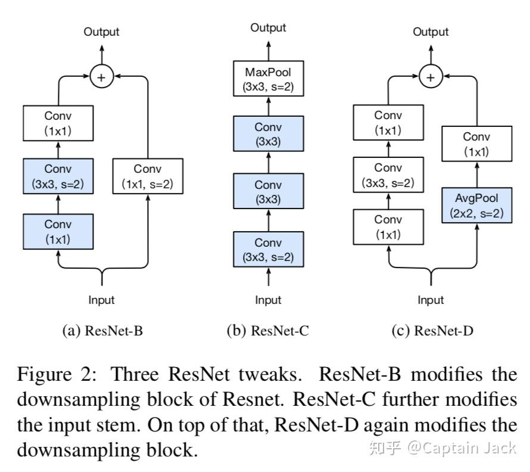
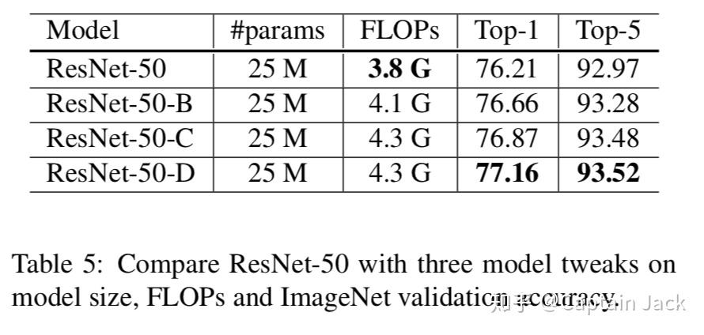

# Bag of Tricks for Image Classification with CNN

 [*Link:*](https://zhuanlan.zhihu.com/p/51833157)

昨天刷arxiv的RSS看到的新文章，作者在zhihu上都能看到......

先过一遍，最近手头有其他事情，有机会再实践，基本都是论文内容罗列，应该是之前说的gluoncv里面的提升手段。

  

主要是三大块：

1. 加速训练
2. 对RetNet结构的改进
3. 针对训练LR，Loss，训练方法的trick

---

## 加速训练  
两大块：一个是增加batch size， 一个是半精度训练，额外工作基本都在batch size的增加上。

Large batch size

1. 根据batch size线性增加lr，常规做法。
2. lr的warm up，常规做法。
3. 初始化的时候，接短接那层的bn权值都初始化成0、0，这样的效果就是最初训练的梯度主要都是直接传递到前面的，相当于是训练浅一点的网络。
4. bias不加正则（还有bn里面的参数也不加）。

## 半精度训练  
好处：

1. 运算速度更快。

2. 占用显存更少，这样就可以提升batch size，最终的结果还是训练的更快。

我试了下pytorch，同样的batch size速度提升的不明显，但是显存降低的是很明显。

所以加batch\_size会额外再提升速度。

## 试验结果  
以上所有都用上，速度快很多，精度还能高那么一点点。

  
可以看到这里的提升，大概是Res50为0.3+的百分点。不知道如果batch size不变的话，这些都用上，会有多大提升（其实就是初始化和正则这两项）。

---

## 结构变化  
  
* **ResNet-B**

 原始的bottleneck里面直接用了1x1 stride 2的卷积在降分辨率，所以换成在后面的那个3x3的卷积上用stride 2。

不过我看了下，torchvision里面的实现已经是这样了。

* **ResNet-C**

 第一个7x7的卷积换成了3层3x3的卷积，也算常规操作。3x3有没有用group我没看到。

* **ResNet-D**

 同样ResNet-B的思想，用在stride=2的block的短接上，先avg pooling，再conv1x1, stride=1这样不丢失信息。

## 试验结果  
参数量基本没什么变化，精度最终增加了一个点的样子，这个改进还是很明显的，不过，主要的提升是B方案带来的0.5，也就是说torchvision里面已经用了的一个结构，当然，另外两个还有0.5的提升。

  

由于都是针对ResNet的改进，其他的网络没有这个收益。

  
作为对比，torchvision的官方精度验证集Top-1是76.15。

---

## 训练改进  
* Cosine Learning Rate Decay
* Label Smoothing
* Distillation
* Mixup Training
+ 随机的将两个sample加权平均，原论文的意思貌似是，网络对输入x和输出y，应该具有向量化的特性，所以两个不同的x可以向量操作，对应的网络输出y也应该有这样的特性。后续我再认真看看这篇原论文吧，只是简单扫了一眼。

## 试验结果  
自己的观察：

* Res50的话，这节里面的工作才是提升最明显的。
* MobileNet则是加速训练和本节的内容都比较明显，但是本节里面主要的提升还是Cosine LR这里。
* Inception也是这节最明显，但是两节的提升都没有Res50大。
* 由于Distillation用的是Res152的网络，所以可能是因为这个原因，对Inception和MobileNet没效果。

  

后面的迁移学习的试验结果就不多说了，结果自然是很不错。针对Segmentation的任务要注意下，不是所有的训练trick都有提升。

