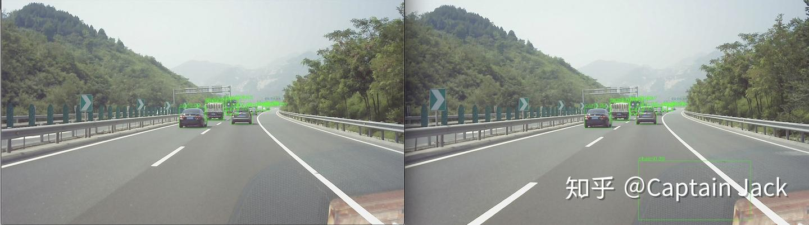

# 目标检测实用中可以改进的方向

 [*Link:*](https://zhuanlan.zhihu.com/p/61038218)

根据目前手头上的工作整理的一份清单，主要是自己的工作过程中，感觉到需要改进或者比较关注的问题，可能和一般的目标检测的研发不太一致，更多的还是些杂七杂八的点。

## 连续帧检测  
一般的训练和评估都是针对单帧图像的，然而，实际应用中，很多都是针对连续帧（或者相近帧）的检测。

在连续帧检测上，即使在观感上，就会比较明显的感觉到不如单帧检测。

现象主要是以下：

* 目标不能连续检出，造成检测框的闪烁
* 偶尔的误识别
* 检测框的偶尔跳变和漂移

  
以上就是连续两帧的图像，用COCO数据的模型。直接把没有处理的裸结果显示出来的话，观感上就非常明显了。

当然，这些都可以在工程上用一些方法来平滑掉。

但是，训练时，怎样让模型可以在连续帧上获得一个平滑的预测？包括检测框本身更加稳定的预测。

## 小目标、远距离检测  
部分应用场景上，对识别距离是有一定的要求的，也就是对微小目标的识别。一般来说，这个需求比较小众，只有一些特殊的应用场景上需要。比如，高速上的目标识别。

在有些要求更高的场合，还需要与摄像头硬件结合，这样可以支持更远距离的目标识别。比如图森的一千米识别。

## 泛化性能  
主要是**训练和应用场景的差别**，毕竟，实际应用是不可能挑场景的。比如：车内物体的玻璃反光、部分数据集不包含的城市、光线变化（特别是图片局部区域光照反常）。

还有一个就是**尺度变化问题**，实际应用中，一般都是类别相对少一点，但是尺度变化范围很大。可能从十几个像素，一直到填满整个图片。算力不愁的话，大不了就是多尺度预测，resize好几个分辨率，都塞模型跑一遍。实际应用，哪有这份闲算力，多尺度预测的条件在应用上不是总能满足。

## 算力节省  
一些在线的预测任务，给模型的算力空间是很小的。要求实时处理的话，那么一般就是20-30FPS的预测速度。即使主流的单阶段模型，预测速度也都是在旗舰GPU上的运行。

比如车载平台的话，功率都是受限的，然而一份功率一份算力。离线的运算还可以增加batch size提升利用率，在线的都是一张张图片，实际GPU利用率也是有折扣的。

不考虑工程上的方法，只能在backbone和检测方法的head里面做工作。

## 难检目标  
各种难度比较大的目标：

* 局部和遮挡：局部的目标可能会出现不检出或者检测框不准的问题
* 模糊和噪点：运动模糊、光线不足下的摄像头噪点等等
* 成组：成组目标会误导检测框的回归。成组目标非常容易出现检测框不准的问题，比如，漂移、整组一个检测框

## 数据问题  
当然，这个是永远待解决的问题，因为数据永远都不够。不多说。

同时，另外一个问题是，实际场景中有些特例就是非常少，甚至采集还得看老天的意思。这个不论是通过数据增强，还是通过模型的改进，目前看来也只能说是修修补补。

## 多任务与多传感器  
**多任务的融合**，比如：组合分割任务（Mask-RCNN）、场景属性预测

多任务中也可以提供更加精细的结构化信息，比如，目标的运动趋势、目标的多属性的预测、3D box、目标距离。

**传感器的融合**，比如：双目、雷达点云、深度信息、毫米波。这些都需要硬件标定和传感器数据匹配，基本都是一台设备一次标定，也少不了体力活。

