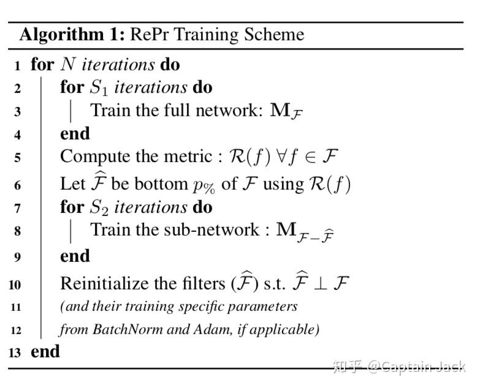

# RePr: Improved Training of Convolutional Filters笔记

 [*Link:*](https://zhuanlan.zhihu.com/p/61133722)

之前看到的一篇文章。当时分给了同事看，自己一直扔那里没看。愚人节中午有空赶紧读了下。

**基本思路：**

* 不断的使用Prune的方法，临时的剔除掉一部分filter。之后再重新初始化，加入训练。
* 在Prune和重训练的过程中，尽量的让同一层的filter之间正交，这样就让filter之间没有太多重复的特征，能够增加更多有效的网络容量。

**工艺流程（咦，为什么我要用这个词）：**

  

---

## 1. Inter-filter orthogonality Metric  
既然是用的Prune的方法，那么就少不了针对filter的ranking：

首先，我们可以知道一层的conv的权重 c\_out \* k \* k \* c\_in，为了方便运算，就可以flatten到 c\_out \* (k \* k \* c\_in )这样的二维矩阵。也就是下面的 $W_l$ ：

1. $\hat{W_l} = W_l \div \left\|W_l \right\|$
2. $P_l = |\hat{W_l} \times \hat{W_l}^T - I|$

在这里 $\hat{W_l} \times \hat{W_l}^T$ 的结果就是每个filter之间的乘积，也就是这一层的所有filter之间的feature correlation。两个filter的乘积越小代表两者越接近正交（完全正交就是0么）。

$O_l^f = \frac{\sum{P_l[f]}}{J_l} $

这一步是计算某一个filter对同一层所有filter的平均correlation。

之后，会把整个网络中所有的filter都按照 $O_l^f$ 排序，值越大，越不重要，越优先prune掉。

## 2. Reinitialize  
上面根据正交特性裁剪掉一部分filter后，会针对sub-network进行几轮的优化。然后会把裁剪的filter重新初始化，再加入训练。

重新初始化的方法我看了下，具体怎么做文中似乎就一笔带过（其实是我线代本来存货就不多，还都还给老师了）：

* 被裁剪前的权值（老的、被prune的权值）+sub-network训练一段时间后的权值（新的、没有被prune的权值），组成矩阵W
* 对W矩阵QR分解
* 找到null-space
* 然后，我只能引用原文了：

> find the null-space and use that to find an orthogonal initialization point.

对于这个，我的猜测：

null-space会是一个n \* （k \* k \* c\_in）的矩阵，我们需要利用这个矩阵（or空间），找到（假设这一层被裁剪了p个filter），p \* (k \* k \* c\_in)的参数。

具体参数，要么是利用null-space随机p个线形组合出的点？或者，直接n里面挑p个出来？

## 3. 对比试验-Orthogonal Loss  
这篇论文的试验确实是太充分了，无话可说。对比试验里面我比较感兴趣的是Orthogonal Loss这块。因为读前面的过程中，我就好奇一个问题：

> 为什么不直接在训练的过程中直接加一个正交化的约束？

但是，作者用试验结果回答了这个问题：**没有显著效果**。

不过看试验结果，即使用了RePr，再加OL还是有半个点的提升的。只是不知道这个现象在更大的数据集上会不会继续保持。

  

对于为什么没有显著效果，我的猜测是：

> 1. 加了约束只是造成了filter之间的竞争关系，结果就是每个filter都只是满足一定的约束，但是没能更加接近完全的正交。  
> 2. RePr直接重新初始化一个更正交的权值，这样会更强的引入这个正交化的先验经验。

所以，按照这个猜测来看，既然有利用prune进行定点爆破这样的骚操作，是不是其他的约束，也可以通过prune变得更强？

## 4. 复现需要关注的重点  
1. Appendix
2. Appendix
3. Appendix

