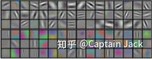
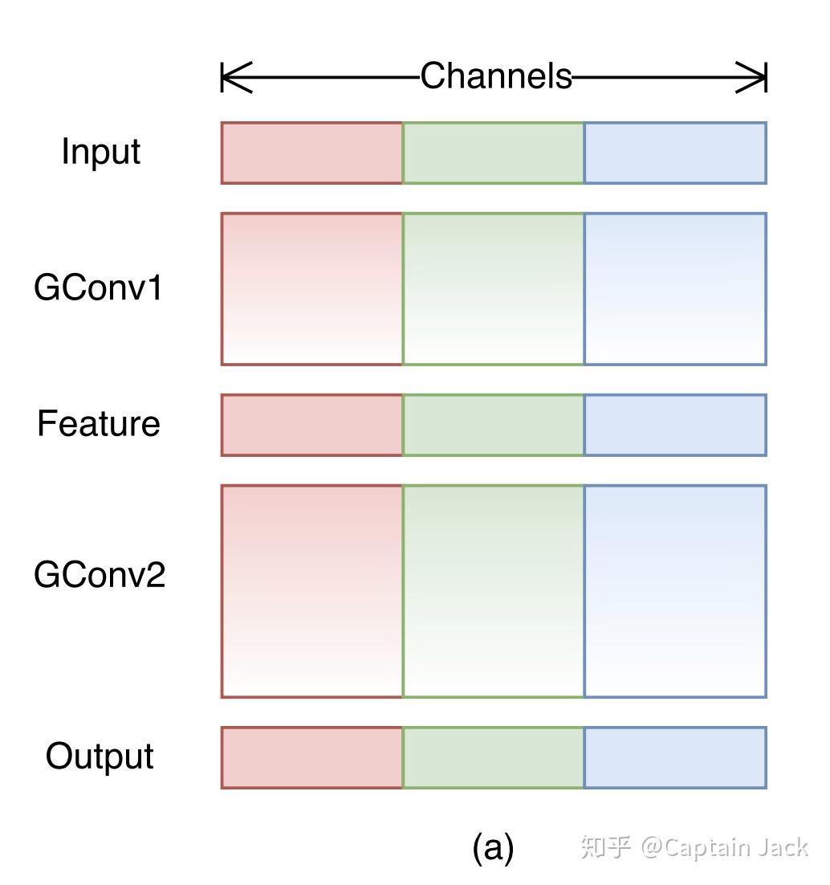
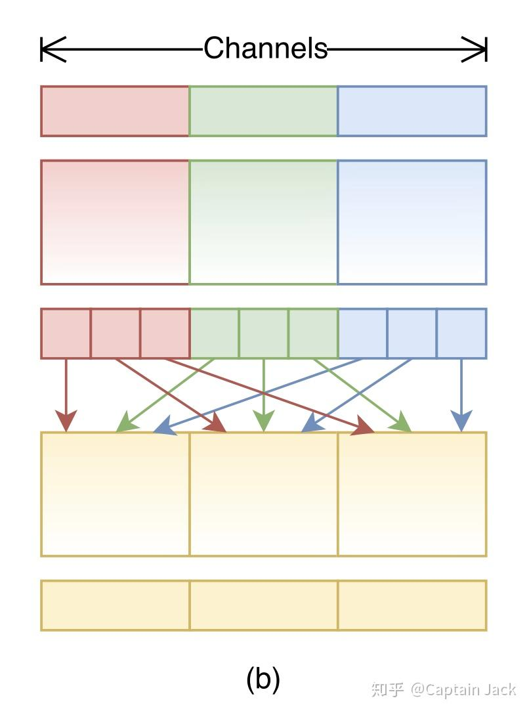

# Group Conv的民科思考

 [*Link:*](https://zhuanlan.zhihu.com/p/65328522)

Group Conv（Gconv）最早还是AlexNet里面因为显存不够并行到两个GPU才用的，没想到，后面被花样开发，先是Xception从Inception进化、ResNeXt为了控制网络复杂度，后面成了轻量网络的标配。 

## 我对Gconv的思考  
**1. 从ResNeXt的角度来看Group：**

理论上：网络越深越好，网络越宽越好。可惜现实很骨感，无论是深度、还是宽度，增加了之后（比较极端的大量增加），反而网络难以训练。这个现象应该很容易遇到。特别宽的网络肯定没有多加几层，每层都窄一点的好训练。 

对于这个现象的原因，目前没有人能够给出让人信服的、比较理论和系统的答案。我自己的经验是：宽度增加反而训练难度变大，应该是参数太多难以训练而且非常容易过拟合，这与Conv和Linear层的不同训练难度是相似的（比如最简单的例子，使用Linear组成的MLP训练MNIST和ConvNN训练MNIST，前者的训练难度是大很多的）。 

但是，针对深度和宽度的这一现象都有人给出了解决方法，其中深度是BatchNorm和ResNet，在宽度这里，何恺明也给出了ResNeXt（Gconv）这个方法：对上层特征建立不同的局部空间(也就是针对channel的group)，降低宽度增加带来的训练困难。这里从我的经验来解释的话就是，Gconv通过将宽度分成多组，减少了单个filter的参数量，实际的结果就是多个稍微窄一点的网络并行，组成一个整体宽度更大的网络，Gconv会有更多的局部性，更加专注各自不同的特征组合。 

所以，Gconv实际上增加了不同特征的局部性，降低了训练难度。

**2. 从网络裁剪（Pruning）的角度解释：**

Filter本身的参数并不是每个都很重要，以128 channel作为输入的1x1 filter来说： 

上一层传入的128个channel并不是每个filter都用的上，单个filter中128个参数，可能有不少是接近于0的，filter的参数有一定的稀疏性。裁剪可以将这些稀疏的参数直接减去（或者置0模拟裁剪），这个操作，在**单个filter**的角度来看，与Gconv是等价的。使用GConv，将网络参数的稀疏性作为先验的限制加入到网络结构中。 

在Group的开山作AlexNet里面，filter可视化图像可以看到，两个group的conv，一个倾向边缘特征，一个倾向色彩： 

  

AlexNet

  
  
这说明，不同filter输出的特征的关系并不是非常稠密的相关，有些特征之间并没有直接的关系。那么稠密的filter，就会浪费一部分参数，而且也更加容易造成过拟合问题。 

在稀疏性上，还有一个维度：图像空间维度，针对flter在图像空间维度上的裁剪也会提升稀疏性。这个其实也就是Incpetion所做的：使用1x3、3x1这样的filter。因为，针对某些图像特征，3x3的filter其中部分参数也是未必需要的，比如xy方向的边缘检测1x3，3x1已经足够完成任务。那么，新的轻量化网络中是否也可以使用这些异形filter来实现计算性能的降低？这里的异形不仅仅是规则的1x3和3x1，也可以是俄罗斯方块形。 

所以，Gconv可以认为是稀疏性在网络结构设计上的应用。

**3. Gconv的极限：DWConv（Xception）**

思考方式中会有一个方法，极端化：如果一件事情，极端到最后会是什么结果？ 

Gconv 的极端化就是每个 filter 都只负责一个特征，也就变成了：filter 仅仅负责检测某个特征在图片局部空间的关系，而不再负责不同特征的组合关系。 

当然，这也带来一个问题：如何再继续处理不同特征的组合关系？可以将 1x1 conv 用于处理不同特征组合的关系。这样的结构也就是 Xception 中的 DWConv。 

这样的结构，将3x3和1x1filter进行了分工：

* 前者负责检测某一特征在图像空间上的分布
* 后者则负责再将单个像素上所有特征进行组合

在功能上进行分工，会降低训练的难度，而且可以引导网络更好的区分概念：让3x3只关注某一个特征在图片中的pattern。而1x1只关注不同特征组合的pattern。

**3. DWConv 进一步 group 与 Channel Shuffle**

之前的所有讨论同样也可以应用在1x1的 filter 上，虽然我们不能极限 group 1x1 filter（极限 group 的1x1 filter 就是 BatchNorm 中的 Scale 了）。但是，我们不那么极限的 group 是可以做到的，这样就如之前的 GConv 一样，让特征空间受限成为几个局部关系。进一步降低参数和运算量的同时，还可以提升稀疏性。 

但是，**会带来一个问题**：如果整个网络都这样设计，最终就是几个非常窄的网络并行预测。 

  
这几个窄网络之间并没有任何交互，我们需要让不同的窄网络中间产出的特征可以互相交互。换做我，简单的就是在中间一些位置上再加没有group的1x1 filter，这样当然也可以实现几个网络之间的交互。

ShuffleNet的方法更加直接粗暴节省算力： 

  

ShuffleNet 对 1x1 Gconv 的补救措施

  
  
直接把特征换一下位置，强行打破几个窄网络的相互独立。 

不过自己的经验来看，Group 是减少 receptive field（特征维度上）的一种行为，这样的行为在图像空间维度上会容易让网络过拟合（前提是 receptive field 不符合数据分布的情况下，SNIP 这篇论文也有讨论这个问题）。而如果对1x1的进行 group，是不是也会带来这样的副作用？ 

---

## Gconv & DWConv带来的效果  
* **参数量与运算量的显著降低**

一般来说，参数量都和模型的表达能力相关，但是在模型参数量保持一致的情况下，Group Conv会带来更好的性能。 

所以相比简单的人工裁剪网络，使用Gconv可以在裁剪到相同模型复杂度的情况下收获更优的网络精度。这也是更好的利用到了网络的稀疏性带来的结果。 

* **训练难度降低**

由于提供了局部特征空间的限制，带来了类似Conv vs Linear的训练难度的优势，更少的参数量、更局部的receptive field（特征空间上）。 

* **天生的模型并行化**

原本AlexNet使用GConv就是为了模型的并行化，所以实际上GConv带来的是天生的模型并行化能力。

* **更方便硬件优化**

并行化+更少的参数量+更强的局部特性，可以更容易增加在一些性能受限平台上的吞吐量。 

1. 并行化容易可以更加独立利用好硬件多核。
2. 更少的参数量+更强的局部性可以更好的减少cache miss，增加CPU和MEM的交互效率，毕竟一旦算力足够，数据通讯就会成为瓶颈。
