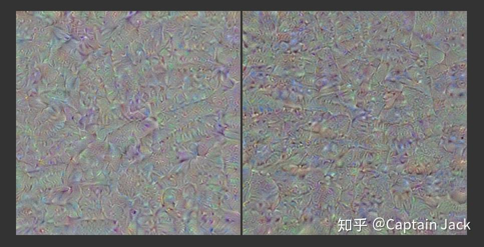
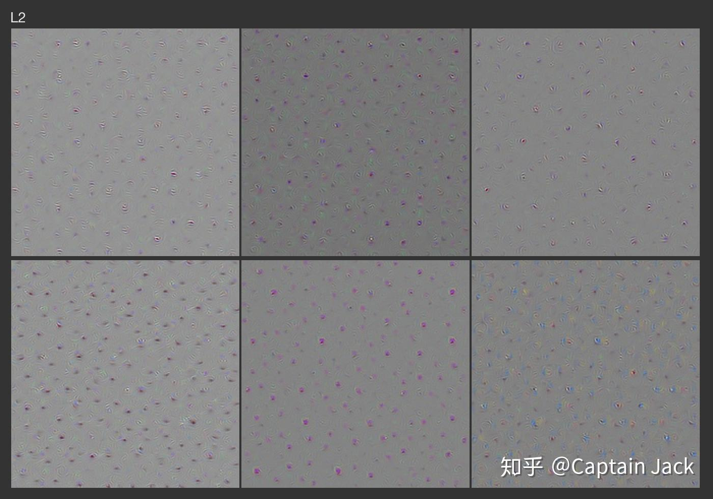
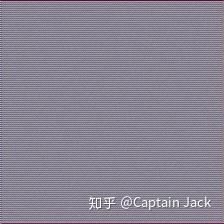
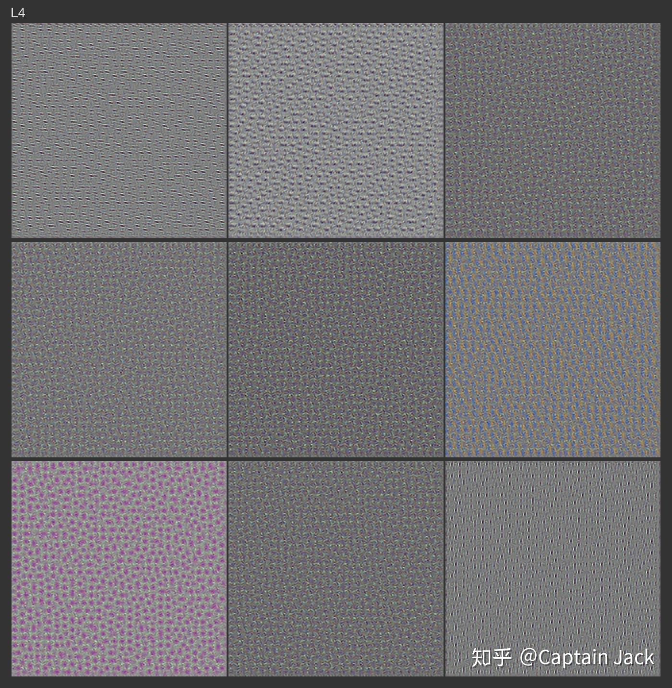
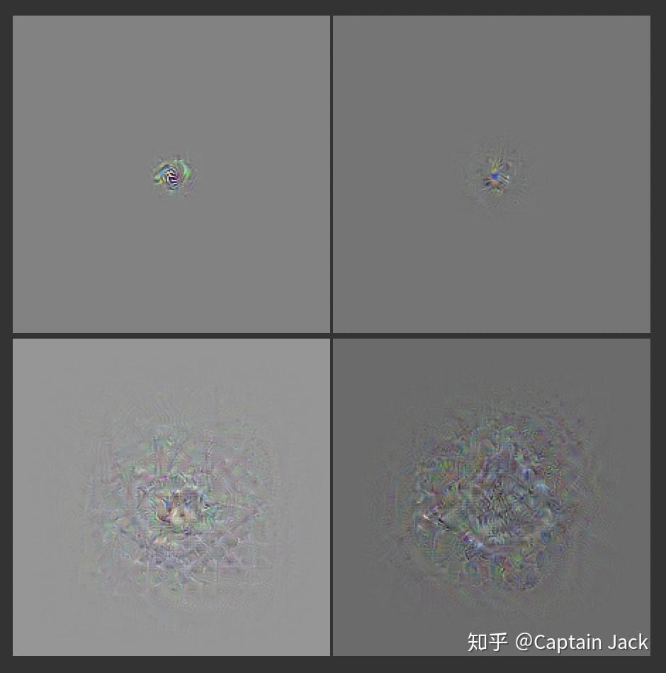
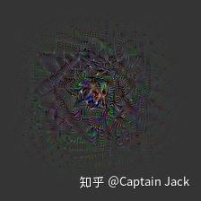

# PyTorch中针对ResNet的可视化试验

 [*Link:*](https://zhuanlan.zhihu.com/p/75721739)

[Captain Jack：Feature Visualization Notes](https://zhuanlan.zhihu.com/p/41429775)  

这篇的后续，跑出来的结果扔在硬盘上大半年多了。本身也没有什么结论，拿出来重新看一下，为了自己的私人KPI，写一篇。。。。

ResNet在distill.pub的原文中就已经说了效果不佳，为毛线我要选resnet跑着玩… 

## 1.部分结果  
这应该是针对比较高层的优化结果： 

  
可以看出来是有一定的模式，但是显然没有deep dream或者distill上其他模型的效果明显，看不出太多有意义的东西。 

  

同时自己也针对网络不同层次进行了优化： 

  
以上是针对比较底层的优化效果，可以看到有比较底层的色彩和纹理特征。这里我应该是用了一个比较大stride的MaxPool接在原始网络层后面，原因是用MaxPool降低空间上的频率，否则一个filter会在空间中过于高频产生交互影响。

如果不加MaxPool，结果会接近下面这张图： 

  
  
后面再抽象一层的结果就没有加大stride的MaxPool，带来的结果就是密度更高（密恐预警）： 

  
后续就是随着网络层次原来越抽象的几个优化结果（这些图片仅仅针对 featuremap 中间位置），可以看到随着网络层越深，conv的感受野也越来越大，当然，最中间的一小块是特征最明显的部分，人眼是可以看出来会有一些莫名其妙的模式的： 

  
附送一个调整了初始分布的优化结果，颜色会更加明显点： 

  
  

---

## 2. 针对结果的一些猜测  
  
因为没有后续的试验和分析，只能停留在猜测这一块。 

  

ResNet效果不佳的原因来自于两个方面： 

**a. MaxPool的消失**  
可以对比前面L2的结果，使用 MaxPool 可以选择性的让梯度通过featuremap中的某一个像素（因为在前向过程中，MaxPool 实际上是针对featuremap中特征值的高通滤波），那么整个图片上的像素是有优化轻重之分，而且也降低了conv不同位置上的梯度在空间上的相互影响，这样更加容易获得类似原文中的更大的有意义的模式。 ResNet仅仅第一层后有MaxPool，后续的都被 stride=2 的 conv 代替。

**b. Residual的引入**  
Residual 链接事实上产生了一个效果：将底层特征和抽象特征进行了叠加。 

这样在反向的优化过程中带来了一个效果：底层特征的梯度会和抽象特征的梯度混合在一起，会让图像中出现比较多的底层的高频特征。 

换句话说，底层特征可能会破坏掉抽象特征的梯度画出的图像（比如狗头一类的）。在重新调整初始分布的结果（因为这张色彩更明显点）里，可以看到中间部分尚有一定的抽象模式，但是稍微到外部就出现更多高频的底层特征，而且趋势是越到外围，特征越底层。 

（那么，针对这个问题，是不是可以在优化过程中限制residual分支的梯度？这样让主体的梯度在优化过程中可以占据更大比例） 

  

反过来思考，ResNet的特征，实际上是高、底层特征的一种融合，而且相对传统结构，用conv 代替了 MaxPool，这样会在featuremap的空间上产生密度（空间的分布频率）更高的特征。

从稀疏性的角度上，降低了很多；同时也带来了一定的尺度融合的效果。

