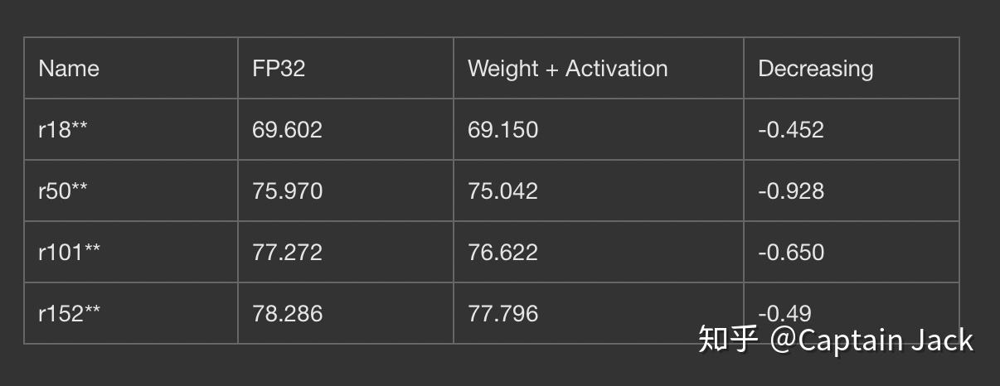

# Pytorch Post Training Quantization

 [*Link:*](https://zhuanlan.zhihu.com/p/82625759)

之前工作的继续，后续加了一些代码，放那里都要生锈了。

[Captain Jack：模型(伪)量化](https://zhuanlan.zhihu.com/p/50518800)代码当然还是努力做到 Self-contained，乌七八糟的比较多，放 Gayhub 上吧：

[https://github.com/qinjian623/pytorch\_toys/tree/master/post\_quant](https://github.com/qinjian623/pytorch\_toys/tree/master/post\_quant)  

当然，精度损失有点大，不过作为玩具，先这样吧。等我把 Quantization-aware training 的玩具先弄好再说吧，现在手上的代码 From-scratch 训练精度差距有点大。

这是用ImageNet三个类别的150张图片做 Activation 量化的对比结果：

  
