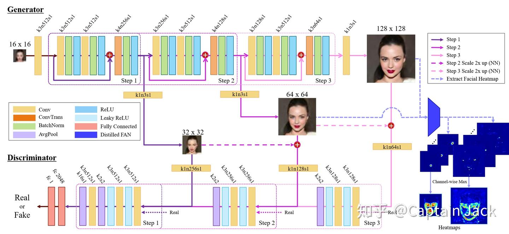
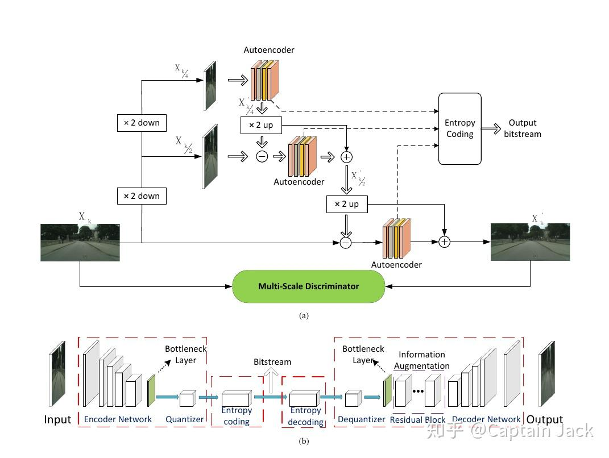

# 两篇图像压缩相关论文

 [*Link:*](https://zhuanlan.zhihu.com/p/87753129)

两篇图像压缩相关的论文。第一篇虽然是Super-Resolution，但是可以认为是压缩的解码部分，思路借鉴一下也没有问题。

图片直接取自原论文或者截图，版权当然都是原作者的。

---

## Progressive Face Super-Resolution via Attention to Facial Landmark  
这篇在reddit上有人拿来当玩具试验了。从论文来看，相比其他方法，脸部细节还原的非常好。

  
  
基本思路主要在下面几点：

***1. 阶段性训练 + 多尺度***

多尺度模型，这个不用多说，只要是对图片细节有要求的任务，用多尺度有九成概率比单一尺度的效果好。即使传统意义上的分类模型，如果你的分类任务需要利用目标中的一些细节信息做区分，多尺度也是重要思路之一。

文中的训练没有直接end2end，而是从低分辨率开始，多个阶段的积累训练。在我看来，可能是因为这套方法的Loss太复杂了，end2end的训练难度太大。

不过文后有对比，end2end的训练实际上效果也可以。但是看着完整Loss里面那么多的参数需要人工调整，还是太痛苦了。

***2. Attention Loss***

这是一个额外的针对人脸的加权Loss。利用Face Alignment Network，获得面部中比较关键的位置，在这些位置上增加更多的权重。我认为这是人脸细节还原非常好的关键因素之一（另外一个就是多尺度）。

本身思路是很朴素的，很多的论文都有类似方法，比如在目标中心增加一个高斯分布的权重、一些论文中的content-weight。不过文中是对人脸很有针对性的FAN网络，而且使用的不是原始FAN，而是重新训练的Distill的网络。

***3. FAN***

相比原始的FAN，文中重新训练了一个很小的FAN，目的是为了加速网络训练。不过从后面的对比试验中可以看到，小FAN网络训练的效果也更好。

我的猜想和论文中的一样：相比原始FAN，distilled FAN对关键点的定位更加模糊，造成实际上distilled FAN获得的加权是整个人脸范围，而原始FAN仅仅加权关键点，忽略了整个人脸范围，造成人脸非关键点位置的还原变差。

***4. GAN***

这个就不多言了，标配。

---

## Extreme Image Compression via Multiscale Autoencoders with Generative Adversarial Optimization  
  
这篇的几个思路：

***1. MSAE***

多尺度，基本思路了。这里用的是图像金字塔，上一篇是特征金字塔。

这里有一点需要提一下的是，在不同尺度之间，做了一下差分，这样的好处是不同的尺度可以关心不同的特征。（差分方法我在自己的训练中做了测试，不过不太成功，还需要后续再确认了）

***2. 主要Loss***

GAN（里面的discriminator也是多尺度的，用的NVIDIA的方法，不过方法本身也很朴素）、Perceptual Similarity。

Distortion、Bitrate（由于自己并不熟悉图像压缩这块的质量评估，所以这里没法更深入讨论这两个，不过这两个实际上也算是图像压缩中的标配）

***3. Information Augmentation***

在Decoder中通过更多的Residual Block可以对编码做更多的“脑补”，实际应用中可以通过增减模块的复杂度控制Decoder的复杂度，平衡性能和效果。

---

**结语**

这两篇基本覆盖了自己之前的几个民科脑洞：

* 图像注意力与算力分配
* 差量压缩
* 多模型联合压缩
* 可调压缩率 encoder和decoder
* 多尺度编码
