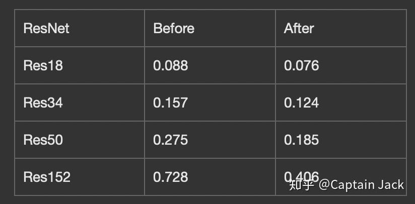

# PyTorch 卷积与BatchNorm的融合

 [*Link:*](https://zhuanlan.zhihu.com/p/49329030)

**2020-05-27 更新**

1. PyTorch已经官方支持了合并操作：

[Captain Jack：MergeBN && Quantization PyTorch 官方解决方案](https://zhuanlan.zhihu.com/p/143664360)2. 有用户爸爸/妈妈（我是讲女权的）在用我的这套代码的时候出现了各种错误，如果还是打算用这套，我将最新版同步到了github上，后面也会不定期同步：

[https://github.com/qinjian623/pytorch\_toys/blob/master/post\_quant/fusion.py](https://github.com/qinjian623/pytorch\_toys/blob/master/post\_quant/fusion.py)  


原文：2018-11-11（本文最后一次更新的时间，神tm的日子...）

  


  


融合Conv和BatchNorm是个很基本的优化提速方法，很多框架应该都提供了功能。自己因为一个Weekend Project的需求，需要在PyTorch的Python里直接这个事情给做了。

这个融合优化属于经济上净赚的事情，精度理论上无损（实际上有损，但是很小，既然都提速了，八成要弄量化，这个精度掉的更夸张），速度有大幅度提升，尤其是BN层接的特别多的情况。


---

**融合原理**

卷积的工作：

$z = w * x + b$ 

BN的工作：

$ y = (z - mean)/\sqrt{var} * \beta + \gamma $ 

带入的话可以推出来，融合后的新卷积：

$w^\prime = w/\sqrt{var}*\beta $ 

$b^\prime = (b - mean)\sqrt{var}*\beta +\gamma  $ 

新的卷积就直接顺路完成BN的工作。

  


**测试结果：**

在我的笔记本上的测试，CPU版本应该是同步的吧，否则这个结果也是不靠谱的，当然这个结果也不是严肃结果，没平均，没热机。不过能定性说明问题就OK，单位是秒。

  
  


---

  


```
import torch
import torch.nn as nn
import torchvision as tv


class DummyModule(nn.Module):
    def __init__(self):
        super(DummyModule, self).__init__()

    def forward(self, x):
        # print("Dummy, Dummy.")
        return x


def fuse(conv, bn):
    w = conv.weight
    mean = bn.running_mean
    var_sqrt = torch.sqrt(bn.running_var + bn.eps)

    beta = bn.weight
    gamma = bn.bias

    if conv.bias is not None:
        b = conv.bias
    else:
        b = mean.new_zeros(mean.shape)

    w = w * (beta / var_sqrt).reshape([conv.out_channels, 1, 1, 1])
    b = (b - mean)/var_sqrt * beta + gamma
    fused_conv = nn.Conv2d(conv.in_channels,
                         conv.out_channels,
                         conv.kernel_size,
                         conv.stride,
                         conv.padding,
                         bias=True)
    fused_conv.weight = nn.Parameter(w)
    fused_conv.bias = nn.Parameter(b)
    return fused_conv


def fuse_module(m):
    children = list(m.named_children())
    c = None
    cn = None

    for name, child in children:
        if isinstance(child, nn.BatchNorm2d):
            bc = fuse(c, child)
            m._modules[cn] = bc
            m._modules[name] = DummyModule()
            c = None
        elif isinstance(child, nn.Conv2d):
            c = child
            cn = name
        else:
            fuse_module(child)


def test_net(m):
    p = torch.randn([1, 3, 224, 224])
    import time
    s = time.time()
    o_output = m(p)
    print("Original time: ", time.time() - s)

    fuse_module(m)

    s = time.time()
    f_output = m(p)
    print("Fused time: ", time.time() - s)

    print("Max abs diff: ", (o_output - f_output).abs().max().item())
    assert(o_output.argmax() == f_output.argmax())
    # print(o_output[0][0].item(), f_output[0][0].item())
    print("MSE diff: ", nn.MSELoss()(o_output, f_output).item())


def test_layer():
    p = torch.randn([1, 3, 112, 112])
    conv1 = m.conv1
    bn1 = m.bn1
    o_output = bn1(conv1(p))
    fusion = fuse(conv1, bn1)
    f_output = fusion(p)
    print(o_output[0][0][0][0].item())
    print(f_output[0][0][0][0].item())
    print("Max abs diff: ", (o_output - f_output).abs().max().item())
    print("MSE diff: ", nn.MSELoss()(o_output, f_output).item())


m = tv.models.resnet152(True)
m.eval()
print("Layer level test: ")
test_layer()

print("============================")
print("Module level test: ")
m = tv.models.resnet18(True)
m.eval()
test_net(m)
```
