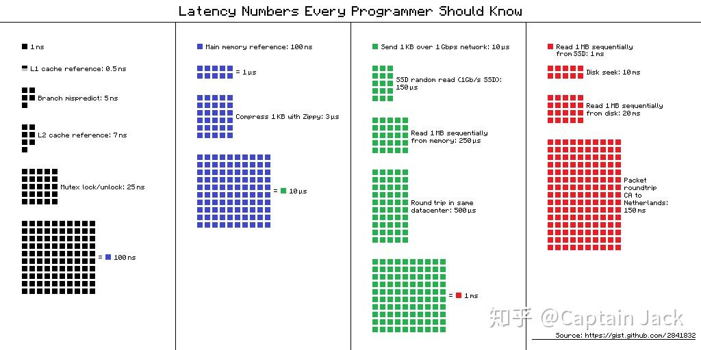

# 一个 CPU cache 的性能小知识

 [*Link:*](https://zhuanlan.zhihu.com/p/150471605)

搜其他问题无意间看到的一个有意思的小知识，原文在这里：

[https://fastcompression.blogspot.com/2014/09/counting-bytes-fast-little-trick-from.html](https://fastcompression.blogspot.com/2014/09/counting-bytes-fast-little-trick-from.html)主要的现象就是：


> 如果不断的修改同一个内存地址的数据（应该还需要满足一个条件：很难静态优化以及预测），性能会降低很多

原文已经年代久远了，所以自己在身边的机器上都试了下，现象依然存在，性能差异在三倍左右。

作者分析的主要原因，按照我自己的理解：


> 对cache数据的写入需要重新同步回内存，如果连续修改同一处内存，后续的修改需要等待内存同步后才能进行。

当然，按照硬件实际的latency，显然不会只有三倍的差异，可能是内存同步中重新修改有额外的一些指令执行。原文中也有其他解释的链接。

有些数字也要时刻记挂在心间：

[https://gist.github.com/jboner/2841832](https://gist.github.com/jboner/2841832)

  
测试代码：


```
 #include <iostream>
 #include <chrono>
 #include <algorithm>
 ​
 using namespace std;
 using Size = int;
 ​
 void count1(unsigned char *db, const Size size, Size *tab) {
         auto tab0 = tab;
         auto tab1 = tab0 + 256;
         auto tab2 = tab1 + 256;
         auto tab3 = tab2 + 256;
 ​
         for (size_t i = 0; i < size;) {
                 tab0[db[i++]]++;
                 tab1[db[i++]]++;
                 tab2[db[i++]]++;
                 tab3[db[i++]]++;
        }
 }
 ​
 void count0(unsigned char *db, const Size size, Size *tab) {
         for (size_t i = 0; i < size;) {
                 tab[db[i++]]++;
        }
 }
 ​
 void init_db(unsigned char *db, Size size, bool seq = true) {
         for (size_t i = 0; i < size; ++i) {
                 if (seq) {
                         db[i] = i % 256;
                } else {
                         db[i] = 233;
                }
        }
 }
 ​
 inline void reset_tab(Size *tab, const Size size) {
         for (int i = 0; i < size; ++i) {
                 tab[i] = 0;
        }
 }
 ​
 ​
 template<class F, class ...Args, int times = 20, class unit=chrono::milliseconds>
 void benchmark_this(F func, Args &&... args) {
         auto t0 = chrono::high_resolution_clock::now();
         for (int i = 0; i < times; ++i) {
                 func(std::forward<Args>(args)...);
        }
         auto t1 = chrono::high_resolution_clock::now();
         cout << chrono::duration_cast<unit>(t1 - t0).count() / times<< endl;
 }
 ​
 ​
 int main() {
         const Size L = 100000000;
         const auto tab_len = 256*8;
         unsigned char *db = new unsigned char[L];
         Size tab[tab_len];
 ​
         init_db(db, L);
         benchmark_this(count0, db, L, tab);
         reset_tab(tab, tab_len);
         benchmark_this(count1, db, L, tab);
         reset_tab(tab, tab_len);
 ​
         init_db(db, L, false);
         benchmark_this(count0, db, L, tab);
         reset_tab(tab, tab_len);
         benchmark_this(count1, db, L, tab);
         reset_tab(tab, tab_len);
         return 0;
 }

```
