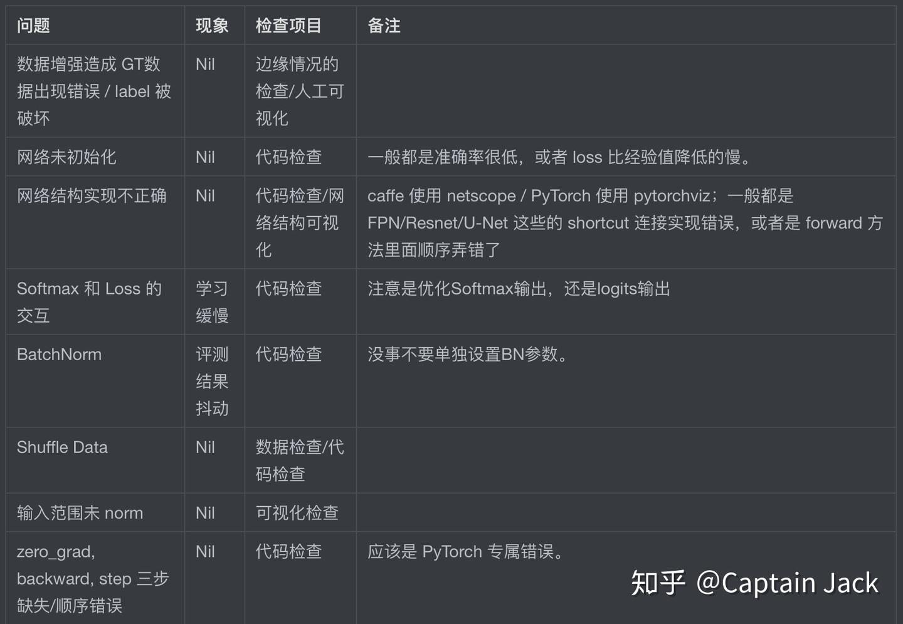

# 深度学习中一些不容易察觉的 Bugs

 [*Link:*](https://zhuanlan.zhihu.com/p/150488289)

由于DL本身的性质，这些问题不会造成程序崩溃/报错等等，所以很难察觉，基本都是靠感觉，排查方法也只能靠人工一步步。一般做第一次小数据量封闭测试的时候，这些就是我的 check list。

这些错误也都是自己经历过的，根本就是一部血泪史。后面有补充链接，可以看看更多别人的血泪史。

  

Nil ​ $\approx​$ 难以觉察/准确率低下/Loss曲线不合经验

  
  
  

**补充资料**

* [https://twitter.com/karpathy/status/1013244313327681536](https://twitter.com/karpathy/status/1013244313327681536)

这是 [https://twitter.com/karpathy](https://twitter.com/karpathy) 的一个 twitter thread，里面也有很多人提到了各种可能的坑，但是我大概浏览了一遍，有一些应该归入调参阶段，有一些不常见。

  

  

## PS  
Markdown 非截图格式版本...

[https://github.com/qinjian623/pytorch\_toys/wiki/dl\_bugs](https://github.com/qinjian623/pytorch\_toys/wiki/dl\_bugs)