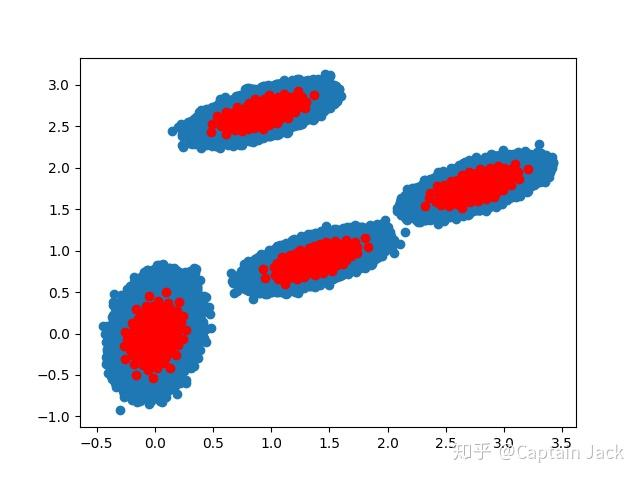

# K-means on PyTorch

 [*Link:*](https://zhuanlan.zhihu.com/p/161865545)

自己需要一个 kmeans 来做实验，显然， scipy 的接口性能不足。目前测试数据已经在 10m 量级了，后面可能还要继续升一到两个数量级。PyTorch 锤子已经在手上了，管他什么钉子，先敲了再说。

目前测试可以在 10m， k=1000 的规模上，完成1次 kmeans 在 20s 以内（在我的私人珍藏古董卡上）。默认是跑 20 次，挑其中类中心平均距离最小的一次作为最后结果，想快就设置 iter=1。

算距离这个事情是最耗显存的，数据集或者 k 太大的话，只能通过设置 batch size 来分段处理数据了。

目前整体够用，未来可能要增加多卡、甚至分布式的能力。

一次模拟测试结果，看着 ( 应该？)没问题（数据量多了太恶心，宛如四只草履虫）：

  
代码位置： 

[https://github.com/qinjian623/pytorch\_toys/blob/master/cluster/kmeans.py](https://github.com/qinjian623/pytorch\_toys/blob/master/cluster/kmeans.py)使用： 

[https://github.com/qinjian623/pytorch\_toys/blob/master/cluster/test.py](https://github.com/qinjian623/pytorch\_toys/blob/master/cluster/test.py)
```
import time
import numpy as np
import matplotlib.pyplot as plt
import torch
from scipy.cluster.vq import whiten
from cluster.kmeans import kmeans


if __name__ == '__main__':
    pts = 25000
    a = np.random.multivariate_normal([0, 0], [[4, 1], [1, 4]], size=pts * 100)  # Unbalanced dataset
    b = np.random.multivariate_normal([30, 10], [[10, 2], [2, 1]], size=pts)
    c = np.random.multivariate_normal([60, 20], [[10, 2], [2, 1]], size=pts)
    d = np.random.multivariate_normal([20, 30], [[10, 2], [2, 1]], size=pts)
    features = np.concatenate((a, b, c, d))
    # Whiten data
    whitened = whiten(features)
    # Half type to save more GPU memory.
    pt_whitened = torch.from_numpy(whitened).half().cuda()

    # kmeans
    torch.cuda.synchronize()
    s = time.time()
    codebook, distortion = kmeans(pt_whitened, 100, batch_size=6400000, iter=1)
    torch.cuda.synchronize()
    e = time.time()
    print("Time: ", e-s)
```
