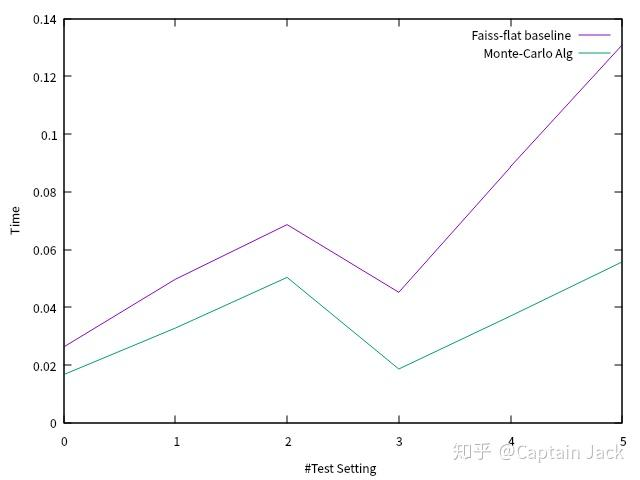
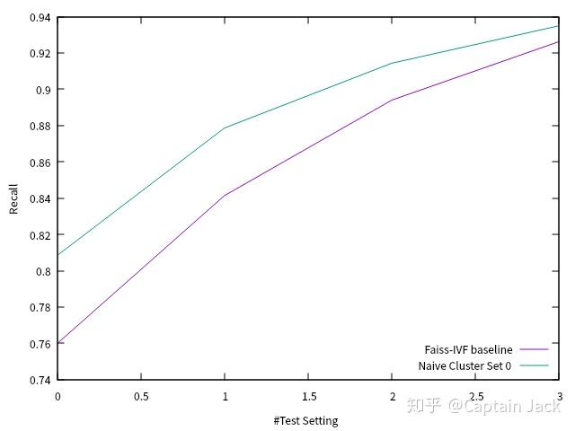

# 向量搜索短期工作总结

 [*Link:*](https://zhuanlan.zhihu.com/p/164955171)

之前一些设想的后续：

[Captain Jack：两个脑洞的工作方向](https://zhuanlan.zhihu.com/p/134139937)[Captain Jack：向量搜索的一些主题](https://zhuanlan.zhihu.com/p/154432300)## 暴力搜索（Flat Search）的性能优化  
目前已经实现了一个利用蒙特卡洛法来采样 query 分布的优化算法，在没有工程手段优化的情况下已经达到了 Faiss 的 `faiss.GpuIndexFlatIP` 两倍以上的速度。

  

不同测试参数下的耗时对比

  
  
以上是不同测试配置下的运行时间对比，前三个 L2 距离，由于用的 PyTorch， 算 L2 慢了很多。后面的 IP 距离，差异才明显起来。

目前的算法都是在 PyTorch 上实现。同样的 MC 算法也可以应用到 Faiss 的搜索上。在 PyTorch 上使用 MC 的提速比例平均在6倍左右，后续移植进入 Faiss 的话，可能也会有这个预期比例。

搜索的召回率测试上，目前在实际业务数据上的小规模测试，基本没有召回损失，当然，MC 的采样参数会有影响，不过目前经验来看，很鲁棒。

## IVF 搜索的召回测试  
  
用小规模业务数据 k-means 聚类做了测试。 和`faiss.IndexIVFFlat`的对比，似乎有几个点的提升（图上提升的边际效用递减也很明显）。不过自己用同事的一个 cpp 版本在相同数据集上做了另外一次测试，提升会稍微小一些，这个分析要先拖后了。

由于前面的蒙特卡洛法的验证、独立于PyTorch的 cpp 版本移植、手头的其他工作耗费了很多时间，造成现在只能模拟测试召回精度，没有高性能版本的实现来对比测试性能，目测要等到下个月内才会有对比实验了。

## Next: NN-everything  
1. 蒙特卡洛也就是个概率分布估计，Neural Network (NN) 的本职工作，应该可以直接替换。
2. 聚类簇 = unsupervised learning / representation learning，NN 的本职工作。
3. IVF Index，这个稍微不是NN本职工作，不过目前也有一些初步想法等待验证了。
