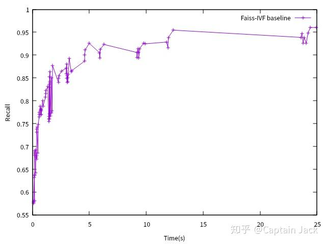
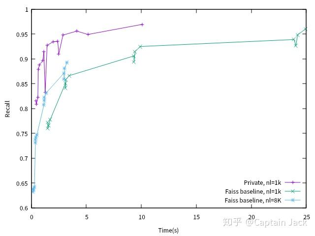

# IVF 性能测试

 [*Link:*](https://zhuanlan.zhihu.com/p/170480391)

上期回顾：

[Captain Jack：向量搜索短期工作总结](https://zhuanlan.zhihu.com/p/164955171)这周补了两个 cuda kernel，现在有了 IVF 的性能高点的版本。目前还没有特别的工程优化（目测主要是并发、内存/显存的分配这两块应该还有改进空间）。

本想找人要一个熟悉 Faiss 调优的同事来搞定 Baseline 的测试，然而并没有。我只能用万金油 `grid search test` 了。拿手头的 10m 测试数据，用 `IndexIVFFlat(GPU)` 测了一定范围内

1. nlist ​ $\in$ [1000, 1024, 2048, 4096, 8192, 16384]
2. nprobe ​ $\in$ [16, 32, 64, 128]
3. k ​ $\in$ [64, 128, 256, 1024]

三者组合的 Recall / 耗时 ，但是感觉这个性能还是有问题的，没有达到最优：

  

Faiss Baseline

  
  
这里遇到的问题是：

> IVF 版本在某些设置下性能不如 FlatIP，调一调 nlist, nprobe 参数赶上速度的话，Recall 又差得比较大。

这个等后续调查，目前仅仅横向对比 `IndexIVFFlat(GPU)` ，其中 nl = nlist：

  
由于自己的聚类 8K 的结果有问题，所以只用了 nlist=1000 这一个配置。

