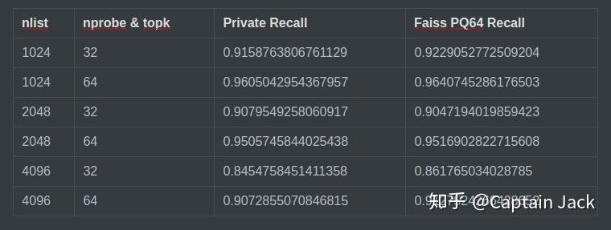
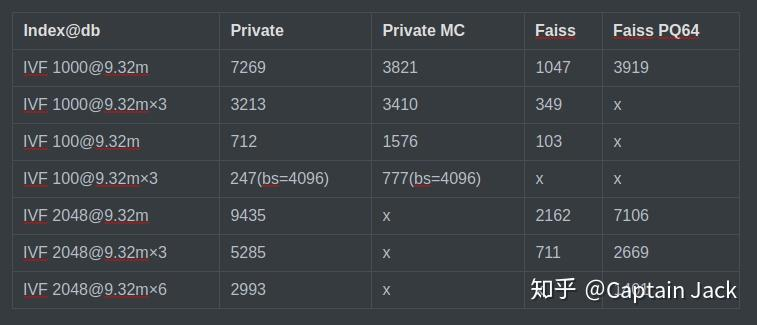
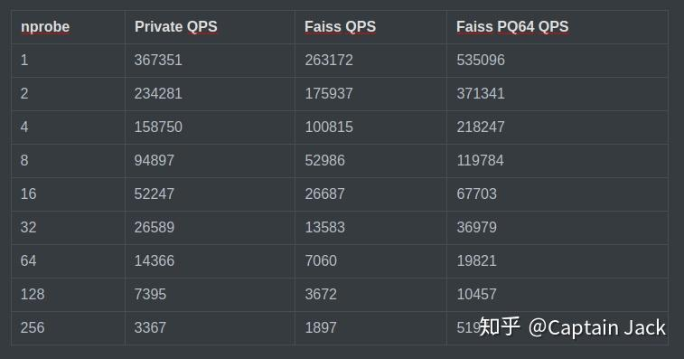
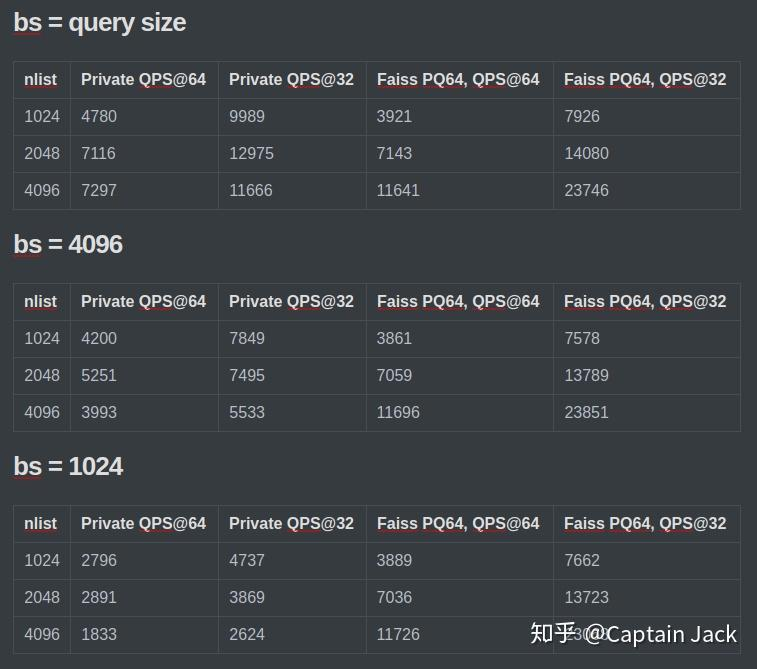

# 向量搜索工作的对比测试

 [*Link:*](https://zhuanlan.zhihu.com/p/199297210)

上期回顾：

[Captain Jack：IVF 性能测试](https://zhuanlan.zhihu.com/p/170480391)  

NN-everything 上最近半个月受挫，不过观察到的趋势是数据规模的增加会提升准确率，还需要改进方法，应该还是有希望的。I see potential.

陆续对三个数据集进行了对比测试：

1. Sift 1M
2. 10M x 64d private dataset
3. 10M x 256d private dataset

（不同数据集存在不同硬件平台的可能性）

整体上，

1. 在能够发挥GPU的一些设置下，性能可以比 Faiss IVF，Flat 快不少。
2. 由于实现缺少工程优化，部分设置下，GPU利用率只有30%，性能衰减也很明显。

## 召回率对比  
@ 10M x 256d

为什么用PQ64作对比？因为 IVF Flat 显存不够，先这么将就吧。

  
按照经验的话，在 topk > 10 时，PQ64 召回率和 Flat 基本一致，所以以上的召回应该可以代表 Flat，尤其是 nprobe=64 的情况下。

整体上落后了一个点不到的样子，可能是因为我为了聚类快点，放松了结束条件。在10M x 64d的测试里面则会优于 Faiss 几个点。

---

## 10M x 64d 测试  
nprobe = topk = 64

  
Private MC 是增加了Monte-carlo 方法后的版本，MC 只在数据量大的情况下才会有优势，所以专门测了一个100的聚类。

在此配置下，性能的优势很明显。不过，后面的 10M x 256d 测试也表明了，IVF 增加和bs减小后性能衰减很严重。

---

## Sift1M 测试  
由于如果使用 Sift1M learning\_set 会有空聚类中心，所以用的 1m 的 base 做的聚类。 测试尽量按照 Faiss 官方提供的`bench_gpu_sift1m.py`配置 。

  
在这个配置下，大概会比 Faiss 对应的 `IVF1024,Flat` 速度提升 50%。

---

## 10M x 256d 测试  
由于 `Faiss IVF*, Flat` 显存不足，目前对比的都是 `Faiss IVF*, PQ64` 的吞吐。从经验上看 `PQ64` 是 `Flat` 的两倍速度。所以，如果这个两个对比接近的话，那么肯定已经比 `Faiss IVF*, Flat` 快不少了。

基本结论：

1. 在 IVF 比较小，batch size 尽量大的情况下，甚至可以超过 `Faiss IVF PQ64`的吞吐。
2. IVF 增大后的性能问题是已知的，未来会考虑改进具体实现。
3. bs 减小后的快速衰减可能是上面一点和循环增加中间消耗太多共同的结果。

  
