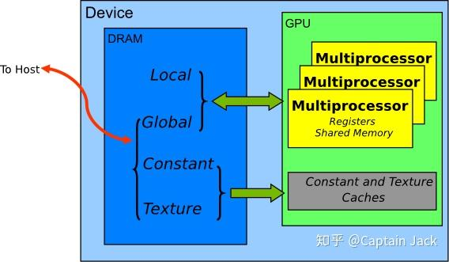
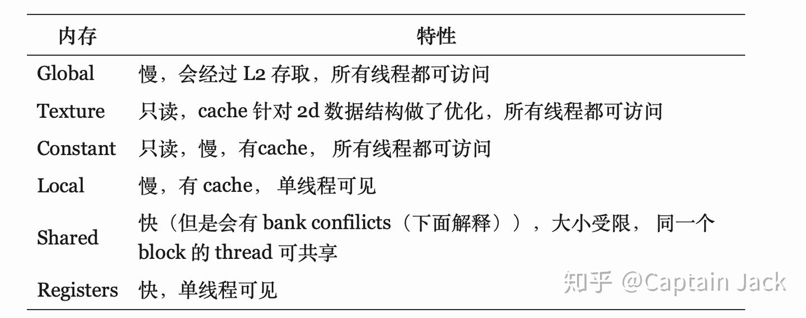
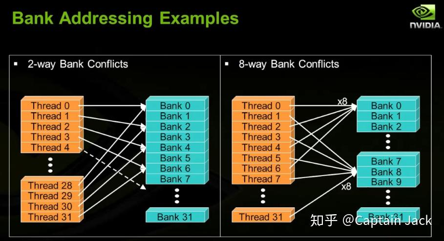
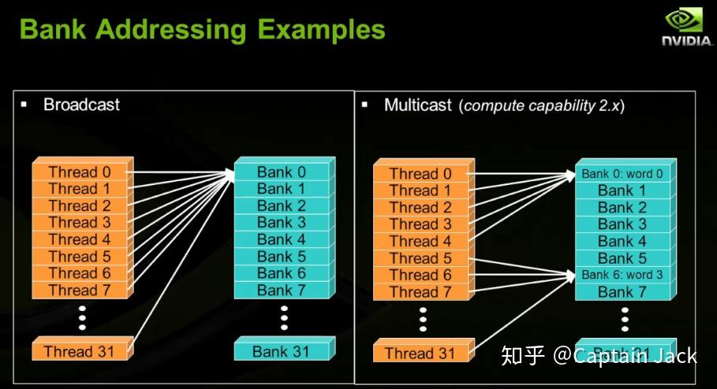
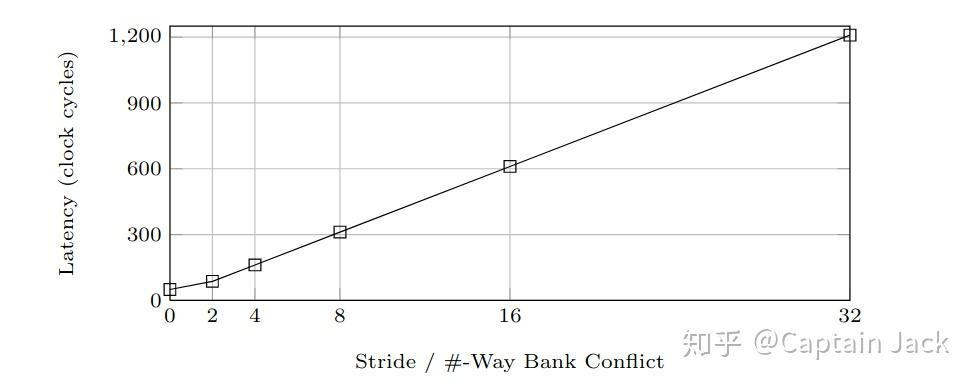
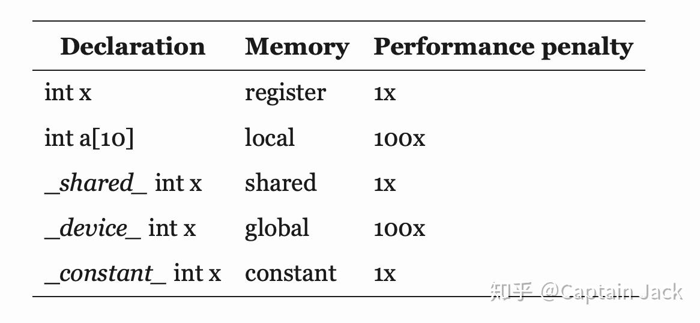
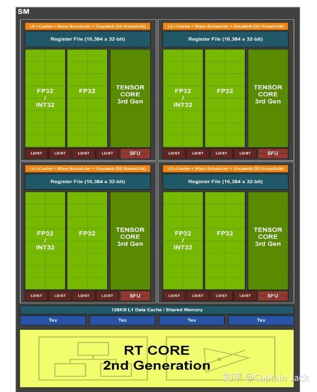

# GPU 硬件层次和调度方式

 [*Link:*](https://zhuanlan.zhihu.com/p/337947104)

工作原因，需要了解一下 GPU 的硬件和 CUDA 的对应关系和调度方法。由于不是专职优化 GPU 代码，所以就是个大概了解。

## TL;DR  
* Perfect solution for {数据并行}
* 硬件设计思路：


```
1. 高吞吐，低响应
2. 无需 cache (目前实际硬件有)，无需复杂的指令调度(多个线程走的都是一样的指令)
3. 节约硬件空间（一次 fetch/decode/dispatch 就可以支持很多个线程，也没有 branch prediction/乱序等等优化需求，硬件空间全省）
4. 可以塞更多的 ALU，增加算力。
```
* 上下文切换可以认为是 0（每个 cycle 都可以切换，寄存器、指令都是同时分配很多个线程的，也就是说线程上下文都准备好了，没有切换开销）。
* 调度基本单位是 warp （目前是一个 warp 是 32 threads），基本硬件调度是 SM。
* 每个 SM 会跑一个 warp，同时等待 N 个 warp 随时可以切换（就看寄存器 shared mem 大小），这 N + 1 个 warp 都是 active 的。
* 如果程序设计良好，active warp 达到了硬件最大支持就可以认为程序的 occupancy 比较高（如果程序已经可以撑满内存的带宽，此时的 occupancy 也就足够了）。
* 多用 shared mem 作为缓存管理可以提升速度，不过会有 bank conflict。
* Thread Divergence 如果 if else 逻辑复杂需要考虑下。


---

## A. 内存模型  
  


  
**内存特性**

  
* 由于 shared mem 的性能良好，所以可以考虑将 global mem 的数据先载入到 shared mem 来提升性能。
* 在 CUDA 11 里面提供了一个新的方法：async-copy，可以提升程序的整体吞吐量。

**访问路径**

* 由于 texture memory 是针对 2d 数组做了 texture cache 优化的， 所以对 global mem 2d 的存取模式可以通过 texture memory 来获得更好的性能
* Global memory 的 read-only 会通过 texture 和 L2 cache
* Local memory 会通过 L1 和 L2 cache
* Texture memory 是只读的 device memory（就是一般意义上的显存），会通过 texture 和 L2 cache
* Shared memory 不会通过任何 cache（因为硬件上，它就是L1 cache，只是名字上叫 memory）

新的硬件（应该是Maxwell之后） L1 cache 和 texture cache 合并，所以没有必要再区分了。而 Global Memory 的读写只经过 L2 cache。

Cache 这块实际上会有更多细分和变化，可以参考[https://arxiv.org/pdf/1804.06826.pdf](https://arxiv.org/pdf/1804.06826.pdf)。

**两个补充概念**

*1. Bank conflict*

  
shared memory 会通过 bank（现在硬件：32 个， 4-byte 1区分） 管理， 同一 bank 内的存取会有 bank conflicts，无法并发。所以在内存读取的时候需要考虑怎样安排计算顺序，让不同 thread 可以操作不同 bank 的数据，增加并行度。

无 bank confilict 的特殊情况：

* broadcast: 所有threads 都访问同一个 bank 的同一个 word。
* multicast: 集中访问几个 bank 中的同一个 word。

  
下面有是不同严重情况下的 bank conflict 的延迟损耗（由于一个 Warp 的调度粒度是 32 threads， 所以，最多也就是 32-way bank conflict 了）:

  
上图可见，极限情况下，同一个 warp 内的线程都访问同一个 bank 的不同地址，会有 30 倍的性能衰减 (也就是 32-way bank conflict)。

*2. Half warp*

由于 bank conflict 会引入 half warp 这个概念，不过新的硬件已经不需要考虑了，并行单元都是 full warp。（可以参见 [https://stackoverflow.com/questions/14909241/whats-the-mechanism-of-the-warps-and-the-banks-in-cuda](https://stackoverflow.com/questions/14909241/whats-the-mechanism-of-the-warps-and-the-banks-in-cuda) ， 这里作者也提到了可能衰减回 half-warp 的可能性）

**Cache**

旧硬件是没有cache的，后续应该是为了增加局部性的性能，有了 L1，L2 cache。

L1 和 Shared Mem 共享硬件空间（可以理解为 shared mem 是程序员自己管理的 L1 cache），可以设置大小 trade off：

1. L1 是不能保证一直在的（可能会被换出，程序员不可控），所以如果对某个内存值多次读取，可以放入 Shared Mem，通过代码来管理，可控性更强（这种情况需要人工管理同步，可能会有死锁）。
2. 粗暴增加 Shared Mem 可能会带来性能下降（L1 cache 小了）

*Cache Line 的大小:*

由于这些值实际和硬件设计相关，未必能对应到新的硬件上。 (关于 cache line 参见[https://zhuanlan.zhihu.com/p/37749443](https://zhuanlan.zhihu.com/p/37749443)， CPU 的，不过在这里是通用的)

1. L1 = 128 bytes
2. L2 = 32 bytes
3. Texture = 32 bytes

所以对于数据如果出现 misalign 的访问，性能也会掉（和 CPU 一样的逻辑），GPU 默认会做 256 bytes 的 align。

**代码与存储的映射关系**

  


---

## B. 硬件架构  
从大到小的顺序，其中 SP 是基本单位：

Processor Cluster -> Steaming Multiprocessor(SM) -> Stream Processor(SP / CUDA Core)

**GA102 结构（30系列游戏卡）**

* 7 x GPC
* 42 x TPC ( 6 / GPC)
* 84 SM(2/TPC)
* { 10752 x CUDA Core (128/SM), 336 x Tensor Core(4/SM), 74 x Ray Tracing Core(1/SM), 256KB registers, [128 KB L1/Shared mem, Texture Cache]}
* 6144 KB L2 cache

*3090 实际硬件是 41 TPC，所以对应的硬件 sped 都是少了一个TPC的数值。*

### GA102 SM  
每个 SM 分成四个 block，INT32 和 FP32 可以并行处理。

具体可以参看：

  


---

## C. 编程模型  
**软硬件概念对应**

* Thread -> CUDA Core
* Block -> SM
* Grid -> Device

线程间的 context switching 很小，会提前预分配好很多线程的上下文。最简单粗暴的优化就是堆线程。只要等待执行的线程够多，Tensor Core 就可以不断的运行。

**调度单位 Warp**

目前硬件是 32 threads / warp， warp 是线程调度的基本单位，无论如何，每次必调度32线程执行，即使只执行16线程，另外的16线程也会占用硬件。

同一个 warp 里面执行的指令是一样的，所以也会共用 instruction fetch/dispatch (这就是所谓的 SIMT 模式)，同一个 warp 里面的线程称作 lanes。

与 Warp 相关的一些优化，可以参见[https://developer.nvidia.com/blog/cuda-pro-tip-optimized-filtering-warp-aggregated-atomics/](https://developer.nvidia.com/blog/cuda-pro-tip-optimized-filtering-warp-aggregated-atomics/)（新的编译器已经自动优化这个场景了，看看思路就可以了）

* Thread Divergence： 由于 warp 内是完全一致的指令，所以如果 warp 里面有 if A else B 的分支会顺序执行（所有需要执行 A 内容的线程完成指令后，再跑需要执行 B 相关的指令，最后再执行后续的指令）。如果一个 warp 中实际 if else 的分叉比较多的话，就需要增加调度，增加等待概率（极限情况是 32 threads 的逻辑路径全不一样，那么在 warp 级别上来看就会有 32 倍的性能丢失）。

**Warp 数量**

Warp 中如果出现有等待（比如读取 global mem），会调入其他 warp 执行，所以只要等待执行的 warp 足够，就可以隐藏掉数据存取的开销。如果计算密集和访存密集的程序放在一个SM上，就可以互相隐藏，获得更好的吞吐量。


---

## D. Performance  
原则指南：Hide latency with computation。

1. 由于 GPU 的 context switch 基本为0，所以只要等待执行的线程足够多，那么存储器的延迟都会被不断线程切换执行掩盖掉。
2. Cuda stream，异步拷贝等等掩盖 latency。
3. 内存访问这块尽量用好 shared mem 和各种 cache。


---

## Refs  
1. [https://nielshagoort.com/2019/03/12/exploring-the-gpu-architecture/](https://nielshagoort.com/2019/03/12/exploring-the-gpu-architecture/)
2. [https://hdms.bsz-bw.de/frontdoor/deliver/index/docId/4500/file/gpgpu-origins-and-gpu-hardware-architecture.pdf](https://hdms.bsz-bw.de/frontdoor/deliver/index/docId/4500/file/gpgpu-origins-and-gpu-hardware-architecture.pdf)
3. [http://download.nvidia.com/developer/cuda/seminar/TDCI\_Arch.pdf](http://download.nvidia.com/developer/cuda/seminar/TDCI\_Arch.pdf)
4. [https://zhuanlan.zhihu.com/p/97131966](https://zhuanlan.zhihu.com/p/97131966)
5. [https://www.cis.upenn.edu/~cis565/LECTURES/Lecture3.pdf](https://www.cis.upenn.edu/~cis565/LECTURES/Lecture3.pdf)
6. [https://www.ce.jhu.edu/dalrymple/classes/602/Class13.pdf](https://www.ce.jhu.edu/dalrymple/classes/602/Class13.pdf)
7. [https://cseweb.ucsd.edu/classes/wi12/cse260-a/Lectures/Lec09.pdf](https://cseweb.ucsd.edu/classes/wi12/cse260-a/Lectures/Lec09.pdf)
8. [https://developer.download.nvidia.com/CUDA/training/sharedmemoryusage\_july2011.mp4](https://developer.download.nvidia.com/CUDA/training/sharedmemoryusage\_july2011.mp4)
9. [https://cvw.cac.cornell.edu/gpu/thread\_div](https://cvw.cac.cornell.edu/gpu/thread\_div)
10. [https://people.maths.ox.ac.uk/gilesm/cuda/lecs/lec3-2x2.pdf](https://people.maths.ox.ac.uk/gilesm/cuda/lecs/lec3-2x2.pdf)
11. [https://www.reddit.com/r/CUDA/comments/gkpjxe/what\_is\_warp\_divergence/](https://www.reddit.com/r/CUDA/comments/gkpjxe/what\_is\_warp\_divergence/)
12. [https://docs.nvidia.com/cuda/cuda-c-best-practices-guide/index.html](https://docs.nvidia.com/cuda/cuda-c-best-practices-guide/index.html)
13. [https://people.math.umass.edu/~johnston/M697S12/CUDA\_threads\_and\_block\_scheduling.pdf](https://people.math.umass.edu/~johnston/M697S12/CUDA\_threads\_and\_block\_scheduling.pdf)
14. [https://developer.nvidia.com/blog/using-shared-memory-cuda-cc/](https://developer.nvidia.com/blog/using-shared-memory-cuda-cc/)
15. [https://jhui.github.io/2017/03/06/CUDA/](https://jhui.github.io/2017/03/06/CUDA/)
16. [https://www.comp.hkbu.edu.hk/~chxw/papers/npc14.pdf](https://www.comp.hkbu.edu.hk/~chxw/papers/npc14.pdf)
17. [https://zhuanlan.zhihu.com/p/258196004](https://zhuanlan.zhihu.com/p/258196004)
18. [https://zhuanlan.zhihu.com/p/166180054](https://zhuanlan.zhihu.com/p/166180054)
19. [https://www.nvidia.com/content/dam/en-zz/Solutions/geforce/ampere/pdf/NVIDIA-ampere-GA102-GPU-Architecture-Whitepaper-V1.pdf](https://www.nvidia.com/content/dam/en-zz/Solutions/geforce/ampere/pdf/NVIDIA-ampere-GA102-GPU-Architecture-Whitepaper-V1.pdf)
20. [https://www.cs.cmu.edu/afs/cs/academic/class/15418-s18/www/lectures/06\_gpuarch.pdf](https://www.cs.cmu.edu/afs/cs/academic/class/15418-s18/www/lectures/06\_gpuarch.pdf)
21. [https://medium.com/@bodunhu/pascal-gpu-memory-and-cache-hierarchy-28439cdee0fd](https://medium.com/@bodunhu/pascal-gpu-memory-and-cache-hierarchy-28439cdee0fd)
22. [http://rcl.ece.iastate.edu/sites/default/files/papers/AwaZam13A.pdf](http://rcl.ece.iastate.edu/sites/default/files/papers/AwaZam13A.pdf)
23. [https://on-demand.gputechconf.com/gtc-express/2011/presentations/cuda\_webinars\_WarpsAndOccupancy.pdf](https://on-demand.gputechconf.com/gtc-express/2011/presentations/cuda\_webinars\_WarpsAndOccupancy.pdf)
