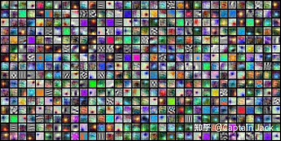
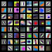

# MLP-Mixer MLP 换用 CNN 的玩具结果

 [*Link:*](https://zhuanlan.zhihu.com/p/372065178)

水私人KPI。

[https://www.zhihu.com/question/457926000/answer/1871444516](https://www.zhihu.com/question/457926000/answer/1871444516) 的好奇后果，直接在 patch 后接传统Conv。

## 结构  
* torchvision resnet 第一层的 conv 设置成了 kernal size=16, stride=16, out channels = 512 (可以认为第一层 Hidden size = 512 的 patch projector)
* 剩下的瞎改了改，凑了个和 Res34 差不多的速度

## 速度  
运算速度比 Res34 略慢

## 参数量  
33.4m，作为对比 Res34=21.8m 左右

## 精度  
Best acc = 70.7680 @ Epoch 81

## 训练策略  
* 无预训练
* 完全按照 torch/examples/imagenet 的训练策略
* bs = 1024, lr = 0.2（没有严格按照 linear scale 做缩放）

显然，还有很多空间可挖。

## 可视化  
第一层 projector 的可视化

  
  
作为对比的 Res18 的 7x7（非 torchvision 官方）

  
