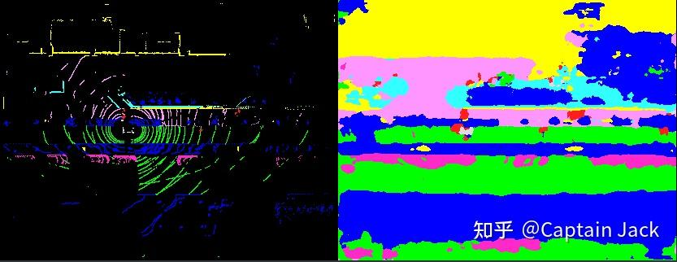

# 多相机融合的感知模型玩具

 [*Link:*](https://zhuanlan.zhihu.com/p/373231275)

水个 KPI，上周花一天时间做的一个 POC 玩具。

## 传感器  
* 4 摄像头（侧面鱼眼 x2, 前后广角 x2）
* 低线束 Lidar x N(仅标注用途，未输入)
* 无硬同步
* 相机系统无标定

## 标注  
* 点云分割的稀疏标注，鸟瞰图视角

## 训练结果  
  

  
基本达到预期，细节上的东西可以后续模型结构、特征融合等等慢慢优化。

1. 具备融合能力
2. 具备空间距离的感知能力
3. 相比点云更加稠密的预测结果
4. 具备多视角补盲能力
