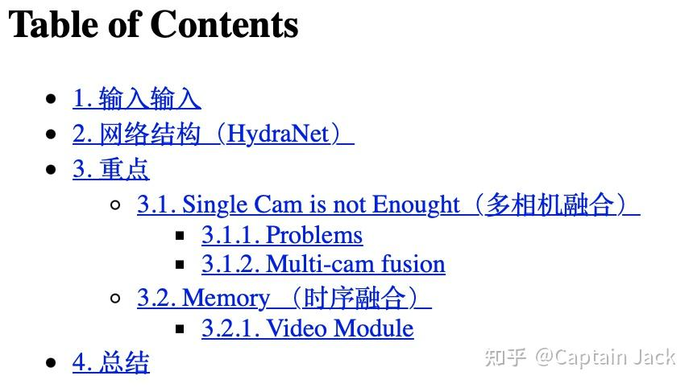
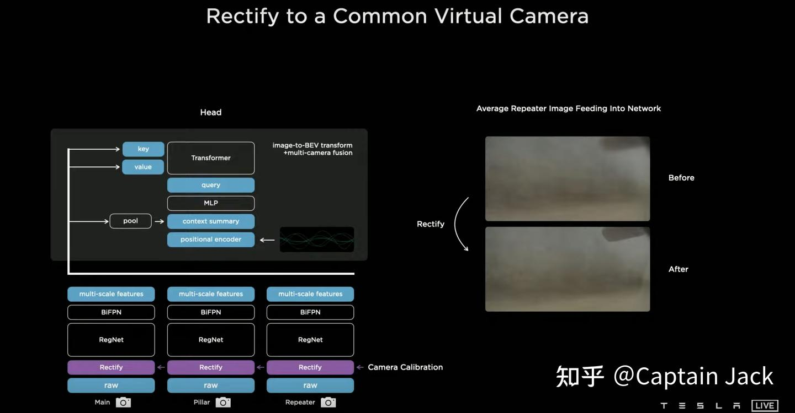
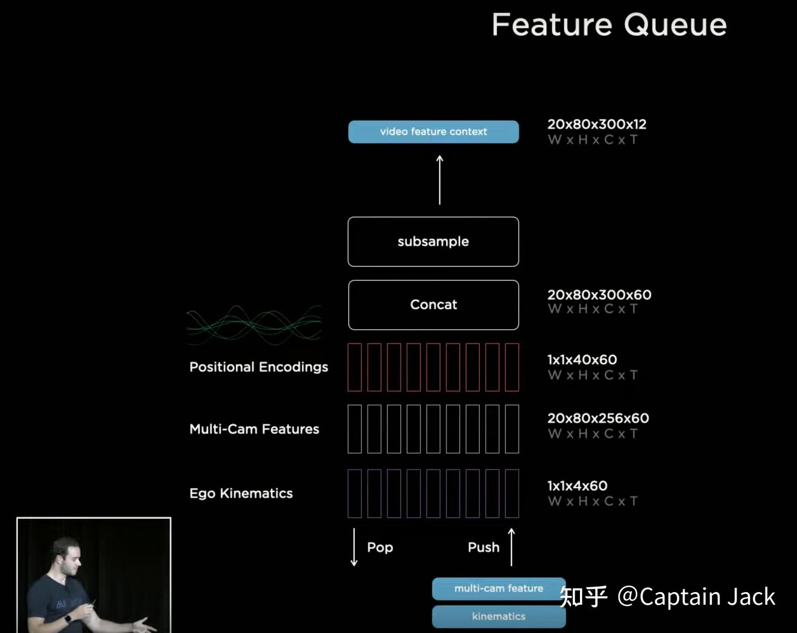
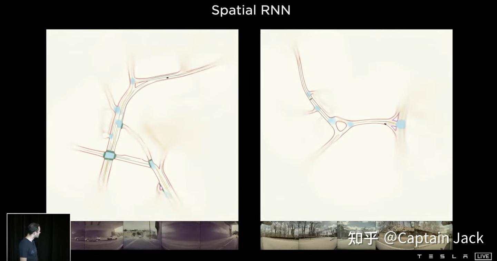
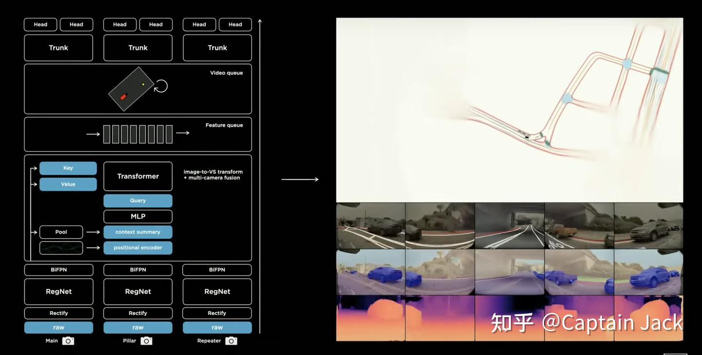

# [Notes] Tesla AI Day - Vision篇

 [*Link:*](https://zhuanlan.zhihu.com/p/403531148)

Tesla AI day 当天看了直播（感谢 hacknews 上有人贴了链接让我看见了），然而这次的内容信息密度实在太大了，而且基本算是全技术栈的能力展示。只能慢慢消化，先看看和自己相关的感知。

相比之前的 workshop 的内容，这次涉及的范围更广，内容深度也稍深：

  


[Captain Jack：[Notes] Tesla CVPR2021 Workshop](https://zhuanlan.zhihu.com/p/384859484)  


  


先吹一波：

Tesla 本身自己搞这块才3、4年时间，做出这个成就，惊为天人。简直是成功的弯道超车典范，或许 Musk 喜欢的第一原则的思考方式对这方面有很大的助益。依靠 trick or 某一项技术妄想弯道超车本身就不是踏实的路线，想弯道超车还是要从战略思路和技术路线层面上来实现，我本人对 Tesla 是真的佩服。

  


---

## 1 输入输入  
* 1280x960 12 bits(HDR) @ 36Hz，RAW
* 输入使用了比较低像素的相机。
* 使用12bits HDR，应该是用来解决相机曝光问题。
* 使用RAW结果，减少马赛克算法等等的预处理，理论上提供更多的信息量。

尽量用 RAW 数据，也是我自己的观点：可以减少曝光动态范围大带来的信息丢失问题。这个观点其实但凡自己有个相机也知道，搞 CV 的手头有个可换镜头的相机都是标配，不啰嗦了。


---

## 2 网络结构（HydraNet）  
***我的观点还是一样：如今，网络结构不是解决问题的关键，后面这些东西你随便换，一样能做到一个不错的结果。***

* **Backbone**： RegNet，目前主流最好的backbone


> good tradeoff of latency and accuracy

* **Neck**： BiFPN，多尺度的传统做法
* **Heads**： HydraNet Detection:


> one-stage, yolo-like

  
提了一个 feature sharing，infer 的时候省算力，训练的时候可以直接用这些保存下来的feature 训练 head， 一样可以省算力，各分任务也可以隔离开，并行发布版本。

这些也算是常规做法，尤其是在 infer 的时候用一个共享的 backbone。

  
训练中，等效 backbone 锁死。实际开发中应该会有一组人员负责 backbone 的提升，定期升级版本。每次升 backbone 都会有对下游的连锁效应，不过 slides 里面也说了，可以用 cached feature 来 fine-tune 下游部分。这样可以并行化训练下游的各项子任务，而且会很快（反正 Tesla 也不缺算力）。

  
backbone 评估一般可以用一个类似 Imagenet 的分类任务数据集，但是在实际业务中，backbone 的评估是需要具体确定一个业务相关的指标来决定是否有提升。

  
在具体任务这块，我好奇的是 Lane 直接用的 fc 来回归，这个具体怎么做没说。


---

## 3 重点  
重点来了，实际上就是两点：

1. 多相机融合（毕竟 Tesla 只用相机，但是这里面的思路扩展到多传感器融合上也行）
2. 时序融合

内容比较多，分开两块了。


---

## 3.1 Singe Cam is not Enought（多相机融合）  
### Problems :  
***Problem 0 - Occupancy Tracker***

用了一个路面边缘 or freespace 来做举例，用单目预测结果后再重新投影到物理世界里面。问题是：


> 1. Across-camera Fusion and tracker are difficult to write.  
> 2. Image space is not output space

别说相机间的 tracker 写起来有问题。单相机内部目标的 tracker 随着要处理各种 case，也会变得一团乱麻。

第二个问题，需要后续的视觉到物理世界的投影。目前单目的测距模型依赖了非常多的先验条件（99%的概率不能完全满足）。造成投影阶段的误差根本没办法控制。

我自己常说的一句话是："你就当传统单目测距的出来的距离是在放屁。"

***Problem 1 - Per-cam detection then fusion（车道线 or 道路结构）***


> need depth projection for every pixal

依然是上面提到的投影问题，这个演示视频应该用的是IPM投影。明显的两个问题：

1. 图像每像素对应的物理空间，随着距离增加会越来越大，也就是解析度会降低。
2. 一旦先验条件不满足度增加，整个投影结果都会出现不稳定。

***Problem 2 - Per-cam detection then fuse (Detection)***


> no single camera can see all of the car

在目标检测上，主要问题就是大型目标的关联和融合，类似毫米波雷达的目标分裂。每个相机都只能检测出一部分，在后续的关联和融合上，很难用一个程序逻辑来处理（和上面的freespace一样，difficult to write explicitly）。

  


### Multi-cam fusion :  
  
基本思路还是之前 Andrej 说的，但是补充了不少细节。主要的两个技术：

***Tech 0 - Learning where to look.(image->BEV + multi-cam fusion)***基本流程：


```
multi-cam, multi-scale features -> Transformer -> BEV
```
  
大概的设计思路是： 

1. Query 代表 BEV 的空间位置的查询，
2. 每张图都会有对应的 Key。
3. 通过 QK（也就是attention） 来计算两个 space 之间的关系（多相机的图像 vs BEV空间）
4. 再将需要的 value 根据 attention 的 score 映射到 BEV空间里面。

  
具体的BEV的空间位置则通过 positional encoding 来表达，看 slides 上，也会有一个 context summary 来表达全局信息，但是我不确定这个 context summary 是否需要根据不同的 positional encoding 来变化。

***Tech 1 - Variations in Camera Calibration(Rectify)***这里算是一个我自己**可以借鉴的相机前融合思路**。  
由于通过模型前融合多相机数据，模型内部隐式的学习到了多相机的位置、视角等参数。但是在量产车中，这个多相机的空间关系是不能保证一致性的：每一辆车的相机组成都有一定的误差，如何消除这个关系？

  
Tesla 这里的做法是通过标定，重新调整所有的车辆的摄像头到一个标准视角上：


> Camera Calibration -> virtual common camera

思路就是，先标定好相机，对图像矫正去畸变、变换RT，最终都投射到一个标准的 virtual common camera 的视角上。这样就可以保证，量产车上的所有的摄像头空间关系都和训练时的视角、畸变一模一样。

在视频里面 Andrej 也举了个例子， Rectify 之前，将不同车辆相同相机的图像叠加后，会有模糊（因为每个相机都有一定的角度差异），但是在 Rectify 之后再进行，那么视角里面的后视镜的边缘就非常清晰（说明每张图都成功对齐了）。

**Detection： Single Cam -> Multi Cam**

这里举例说明多相机融合的优势：

1. 目标（尤其是跨相机的大目标）的识别更加稳定
2. 相机边缘位置的目标可以更平滑的识别


---

### 3.2 Memory （时序融合）  
  
开始第二点，时序融合。为什么要做这个就不多啰嗦了，实际做过 AD 感知的都知道纯粹的单帧结果没有任何意义。很多状态无法识别，比如：

* 速度
* 方向灯状态
* 目标的遮挡与重现

Andrej 给这个模块起的名字是 Video Module：


> Feature Queue + Kinematics(IMU) 60-step history

* ***Sequence sample***时序融合的第一个问题就是：采样周期如何确定。  
对摄像头来说，天然的就是每帧采样。但是带来的问题是，不同速度下的每帧采样，两帧间的空间差异是不一样的，多帧的图像模型很难适应这种变化。我自己之前一直坚持用轮速仪器来等距离采集，起码在图像的空间关系上保持了一致性。  
不过 Tesla 作为一个成年人，用了很简单的方法：**全都要**。


> Time-based: 27ms 周期  
> Space-based 1 m 周期

* ***融合模块***3d conv/Transformer/RNN 都试了，RNN的效率最高。重点介绍的是 Spatial RNN，可能因为这个看起来比较炫目。

  


* **Spatial RNN （map）**

  
1. 先建立一个 BEV 的大图，譬如 1000x1000，车辆的感知范围可能是 30x40。
2. BEV 视角下的每一个像素点（or pillar，如果搞激光的话）都用一个 RNN 来维持状态。
3. 只要感知范围覆盖了，就用对应特征跑一步RNN。

在我看来，算是一种结合动静态目标的地图。一旦感知可以看到地图上的位置，就开始更新对应点上的特征。不过这里没有具体说明，随着车辆运行空间增加，如何处理新旧的空间的加入和丢弃策略。最粗暴的可以只存车辆周边 NxN 的格子状态。

  
Andrej 本身也提了，这个可以通过车队来组类似 HD map 的东西，或者我们就叫他 abstract feature map 吧。

* **时序融合优点展示**

  
1. 对于临时遮挡目标有了记忆能力、
2. Velocity/Depth 的预测基本做到 Radar 级别，尤其是对速度的估计，比单帧效果稳定了很多（这个结论也合正常逻辑）

  


## 4 总结  
  
Andrej 说了下他们可能的工作方向：


> Fusion of space & time is late in network. Can do earlier fusion. Output is dense rasters. Predict sparse structure of the road (point by point).

