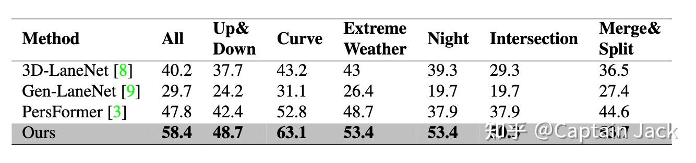
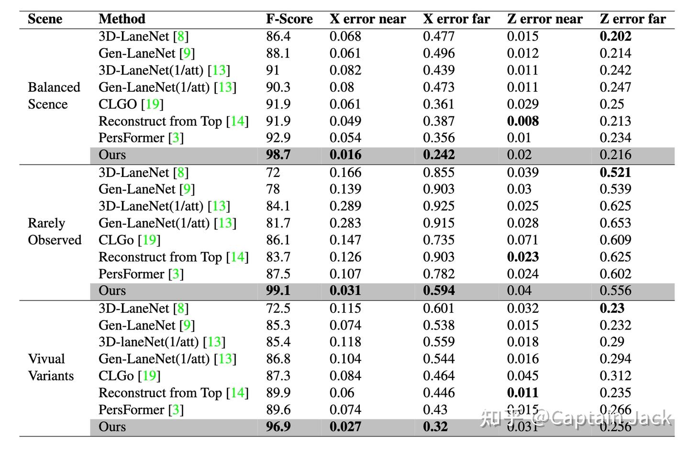
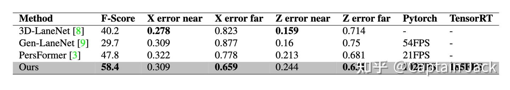
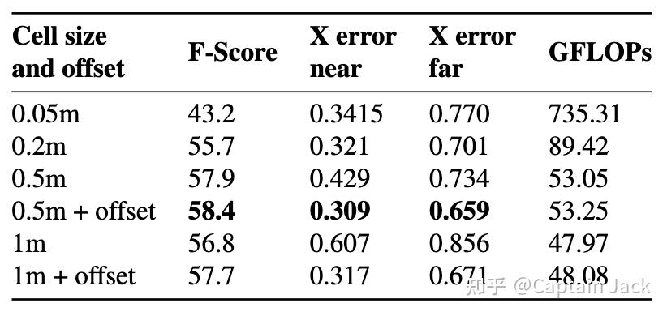

# 自己小组的一篇 CVPR23 车道线检测论文

 [*Link:*](https://zhuanlan.zhihu.com/p/614191683)

CVPR 中了一篇车道线检测相关论文，简单介绍一下。本身比较偏应用，预期是workshop，运气比较好，磕磕碰碰主会接收了。

[https://arxiv.org/abs/2210.06006](https://arxiv.org/abs/2210.06006)具体工作绝大部分都是一作的瑞豪同学完成，可以关注他对这个任务更加具体的理解：

[王瑞豪](https://www.zhihu.com/people/wang-rui-hao-97-20)我简单介绍一些论文的内容，以及目前我们对 BEV 任务的观点。

## 论文介绍  
主要的工作是三个：

1. 虚拟相机
2. 基于 FC 的 3D 转换特征金字塔
3. 类似 Yolo 中心点的车道线表达方式

受制于我们的目标算力平台，结构中只有非常基础的算子：Conv、Linear、ReLU、Upsample or Deconv。对硬件部署已经到了友好的极限。

### 指标和运行速度  
简单说一下指标和运行速度，证明这是一个有效而且高效的方法。

**指标**

论文里的指标：

  

OpenLane V1

  
  
  

Apollo 数据集

  
  
现阶段我们**内部的 F1 指标：OpenLane 在 62+，Apollo 整体在 99 左右**。训练手段还没有上全，所以这一方法还存在一定的潜力空间。

**运行速度**

虚拟相机这块可能需要单独提一下，因为不是传统的神经网络算子：

  
CPU 使用的 OpenCV 实现，在我自己的 M1 Air 上只需要 0.5ms。也可以用 cuda 实现高效的并行，部署硬件如果有一定的自定义能力也可以通过查表来实现，所以 bottleneck 大概率在内存（memory wall）上。

模型速度，Resnet 34 的backbone：

  
如果对于算力要求更加严格，可以直接替换 backbone 成 Resnet18，指标上基本没太大区别（掉 0.x 点），速度可以到 270+ FPS，这个论文里也有一项说明，这里就不提了。

我们内部也使用比较小的 RegNet 做 backbone 来压榨性能。

### 虚拟相机 （论文里的 VC）  
顾名思义，启发来自于 Tesla AI day 的虚拟相机。

在当时特斯拉公开后，我就和标定的同事讨论了通过相机进行类似工作的可能性。当然，想要完全做到 Tesla AI day 里面的效果有点难，只能统一某一个平面，但是这个限制并不会影响车道线任务。说到这其实也很明显了，就是一个单应转换。

我们假设了一个虚拟的 ”标准相机“ 的标定参数，还有这个 ”标准相机“ 对应的 ”标准地平面“：”标准相机“ 不考虑动态带来的外参变化的绝对理想地平面。

使用时，只需要利用标定参数提前算好的单应矩阵，将所有 ”非标相机“ 的地平面都转换到 ”标准地平面“ 上就可以了。

对于网络来说，这个工作实际是：在图像空间中针对地平面这个维度，做了一次 alignment。有助于减少不同相机的安装位置不同造成的学习过程中的一对多关系的出现。

在预处理阶段完成数据对齐后，网络结构中就不再需要相机参数，也就为提升速度打下了基础。

### 3D 转换的特征金字塔（论文里的 STP）  
实际使用的是 VPN 做的静态映射，如果从传统算法的角度理解，那就是我们用 Linear 学习了一个 “标准相机” 到 “标准地平面” 的 IPM。

考虑到 backbone 中不同层的特征，自然是把 FPN 的思路用在 3D 转换上。

综上，我们用多个 Linear ，学习了不同尺寸的 featmap 到 “标准地平面” 的多个 IPM。

这个做法其实不够 fancy，也讲不出啥故事。其实在使用 VPN 的思路之前，用的是一个更加暴力的方法，当时的指标和 VPN 也没有太大差异，不过 VPN 的思路更加符合先验逻辑，后续也就没用暴力版了。

我之前在 

[Captain Jack：BEV 3D 转换模块的动静态任务特性与选择](https://zhuanlan.zhihu.com/p/604293845)中也说明了 ST 和 SM 的天然友好的关系。我们内部其实也测过了多个动态模块（包括 LSS、 Transfomer 变体），所有这些模块的指标都没有超过 STP。这些测试是基于如下因素对齐的：

1. 同样的训练技巧和超参
2. 除去转换模块以外，基本一致的网络结构
3. 同样的数据集

这是一个对于工程研发很有启发的现象。

### 类似 Yolo 中心点的车道线表达方式（论文里的 KPR）  
这其实也是很传统的思路： bin + offset，目标检测、回归任务上很常用。包括在 Tesla 的 后续的 Occupancy Network 里面，也有这样的思路。离散化的 voxel 表达，会有精度不足的问题，通过增加连续数值表达来配合。

  
使用 KPR 后的好处：

1. 降低了正负样本的比例，更加容易学习
2. 降低了 bev 的分辨率，直接提升速度
3. 有了连续数值的表达，理论误差可以到 0

Embedding 这块，不多介绍了，用来辅助车道线 instance 的聚类。思路简单，但是很适合数据驱动，相比 LaneAF 这种增加了先验知识的，表达能力更强。这个我在 [https://zhuanlan.zhihu.com/p/501918652](https://zhuanlan.zhihu.com/p/501918652) 里面也提过，增加了先验后，有些 case 是不好处理的。工业实用中，数据是可以加的，嵌入模型的先验不好改。起码我们目前的很多工作都可以归结成一句话：”加点这个场景的数据吧。“

  

## 一些观点  
### 三个工作的问题  
1. VC：工装误差肯定可以cover，甚至更夸张的位置偏移我们都试验过。但是过大的外参差异还是会超出 VC 的能力范围。
2. STP：由于静态映射和“标准地平面”的限制，这些条件不满足的时候，比如在有坡度的情况下，要稍差一些。但是 backbone 和 head 可以稍微补偿一部分。
3. KPR：这个表达依然还是比较传统的车道线检测思路。现在很多论文已经提出了更加结构化的表达，是从地图构建的角度出发的，这确实是未来的一个方向，目前我们的表达已经显露出一些不足。

### 车道线任务的特性  
车道线是一个全局、稀疏任务。

我们试过在 BEV 上直接增加 global attention，效果有可见的提升，不过由于硬件限制，没有参与部署。

各种使用了 Transformer 的方法，可以更好的利用稀疏性，比如 Tesla 的车道线表达。不过在实际使用中，依然很难避开 dense 的预测，除非完全的 E2E，起码目前阶段这个稍微有点科幻。这个属于某种 trade off，目前阶段，我们不会太追求稀疏。

### 转换模块  
在这里我们已经存在一些新的理解，不过还在概念验证阶段，需要等待试验结果。目标是更加简单高效的op，同时又可以处理好动静态任务。

