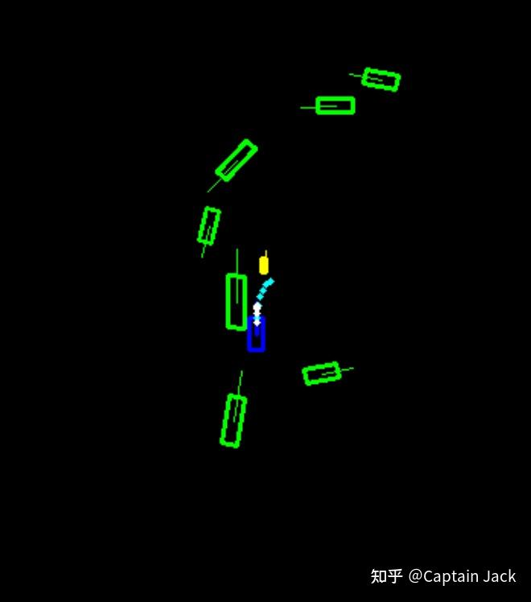

# 规划模型的PoC及难点

 [*Link:*](https://zhuanlan.zhihu.com/p/620903942)

我让 GPT-4 帮我润色了下，省略了很多废话，顺便让他给了一份中英文的总结，简直就是6。

## GPT-4的总结  
### 中文  
最近一个月，我们进行了一系列概念验证，与规控团队讨论并形成了初步的设计方向，目标是方便地融入现有框架。开放环路测试结果显示，模型在不同时机的选择上存在差异。评测存在一定难度，可靠的评测方法只能依赖闭环评测。模拟器在实现更贴近实际的模拟方面面临诸多挑战。我们引入了低级指令（LLI）概念，以建模规划路径中的模糊区间。未来，我们将引入占用网络、红绿灯与标识等信号，以及新版本的感知模型。

### 英文  
Over the past month, we have been conducting a series of Proof of Concept (PoC) validations and discussing preliminary design directions with the planning & control team. The goal is to seamlessly integrate these designs into the existing framework. The open-loop test results demonstrate differences in the model's decision-making at different moments. Evaluating the model poses certain challenges, with reliable evaluations relying on closed-loop testing. Simulators face numerous obstacles in achieving more realistic simulations. We introduced the concept of Low-Level Instructions (LLI) to model the ambiguity in planning paths. In the future, we plan to incorporate signals such as occupancy, traffic lights, and signage, as well as a new version of the perception model.

## 目前验证模型的情况  
接上篇

[Captain Jack：NO-HDMap 传统归控方案面对的问题](https://zhuanlan.zhihu.com/p/611768397)的工作内容，最近一个月，我们在进行一些概念验证，并与规控团队讨论形成了一些初步的设计方向。我们的目标是使这些设计方便地融入现有框架。

在验证集合上的开放环路（open loop）测试表现出了一些有趣的结果：

### 模型在不同时机的选择上存在差异：  
* 与白色的GT相比，模型在路口转向时似乎更为激进。
* 在后续几秒内，当车辆即将越过黄色障碍物时，路径会突然改变，绕过前方障碍物

  
### 通过调整目标位置和LLI（低级指令，后续将简要解释）可以直接影响路径规划  
Lily\_x 是传递给模型的一部分LLI

[https://www.zhihu.com/video/1628903715573862401](https://www.zhihu.com/video/1628903715573862401)## 目前面临的一些难点  
### 评测难度  
物理世界的时空一致性难以保证。传统机器学习的评测集方法仅能作为开放环路测试，无法确保自车与环境元素之间的交互。评测结果缺乏说服力。

可靠的评估方法只能是闭环（close loop）评测，这需要进行实车测试或接入模拟器。实车测试的问题在于缺乏可复现性，成本高。如果成本低，尚可通过数量来缓解复现性问题，少量数据最后会变成针对具体的case，这和统计模型解决概率问题是互相冲突的。

而在模拟器中的评测，难点主要来自于两方面：1. 多智能体交互问题；2. 如何实现更贴近实际的模拟。贴近实际，需要对感知端的结果有比较全面的评测，这样才能在模拟器中根据感知评测的结果进行模拟，包括：误检、漏检、距离误差、FoV遮挡等等。否则，基于完美感知的评测一样没有说服力。

### 模拟器难点  
障碍物可以依靠评测结果模拟误检和误差等概率问题，但静态元素的模拟较为困难。如果使用高精地图（HD），则相对容易进入模拟器。否则，在感知结果模拟上存在很大难度。

对于模拟器，需要考虑是否模拟原始传感器的输入。相对而言，激光雷达的点云数据更容易实现模拟，特别是在厂商能配合模拟一些硬件特性的情况下。与图像相比，更容易贴近现实世界，但相机传感器模拟的难度较大。

为了复现某些案例，模拟器需要具备环境重建能力，无论是通过传感器结果还是感知后的结果。然而，这些工作已经不再属于传统模拟器的部分。

### 模糊区间的建模：LLI（Low-Level Instruction）  
由于规划路径存在较大模糊区间，需要一个因素来建模这种条件概率。为了考虑这个因素，当前模型引入了低级指令（LLI）的概念。

LLI主要融合两个因素：

1. 中长期目标
2. 隐式的规划模糊表达

通过这两个因素，我们可以对预测的航点产生一定影响。从目前的分析来看，这有一定的能力来控制规划的激进程度。

### 未来会引入的信号  
* Occupancy，公司内部已经有现成的模型，但由于数据问题，接入这个信号会有很多麻烦。
* 红绿灯与标识。
* 新版本的感知模型，目前阶段的数据仍使用老版本感知结果，看起来融合关联上存在很多问题。
